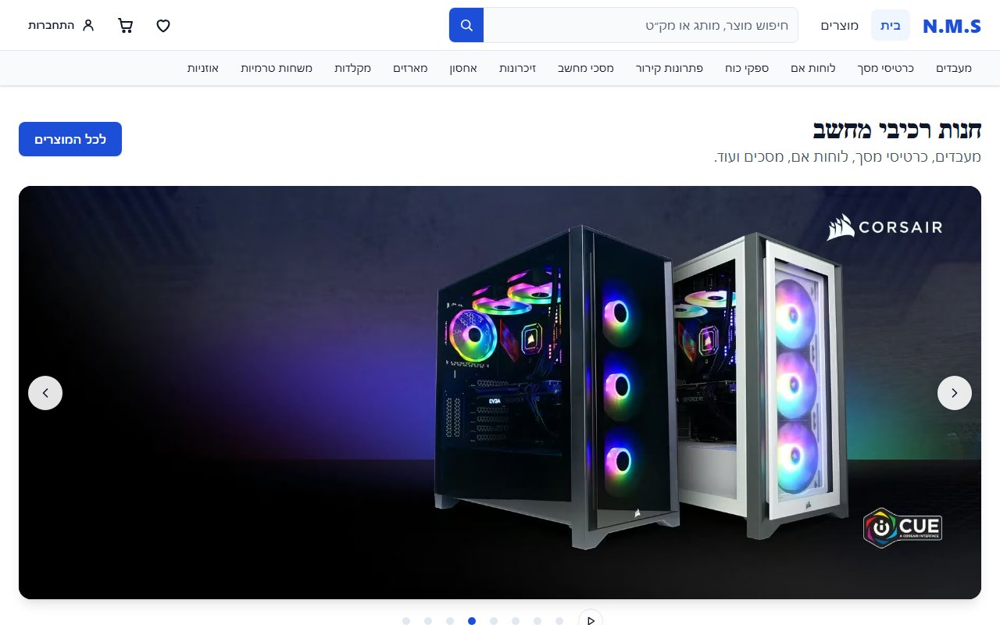
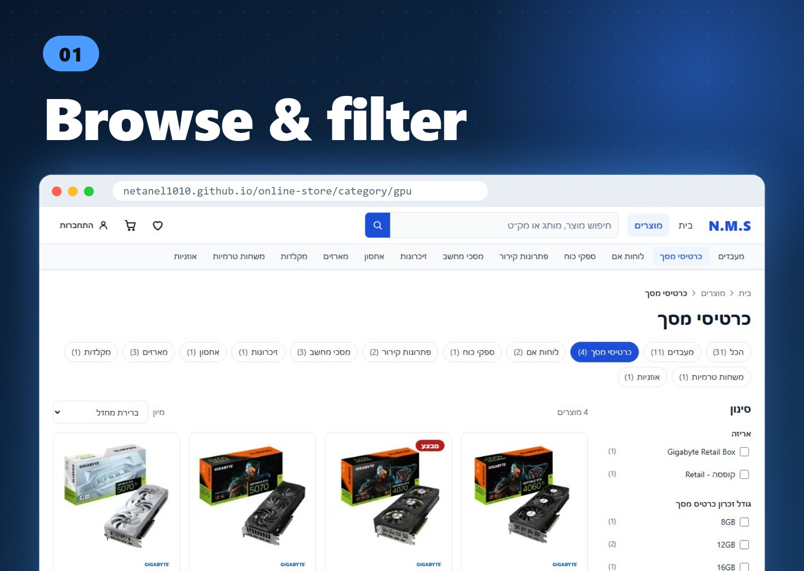
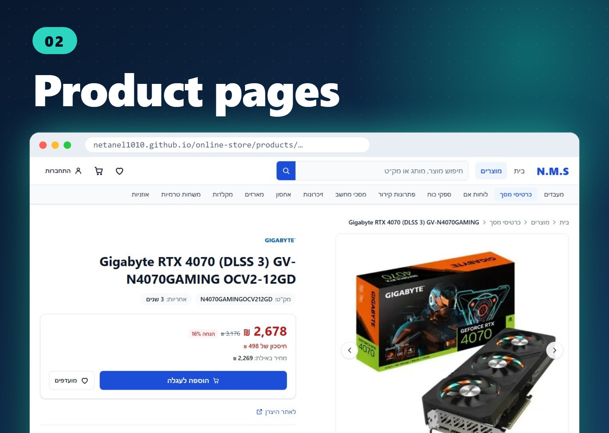
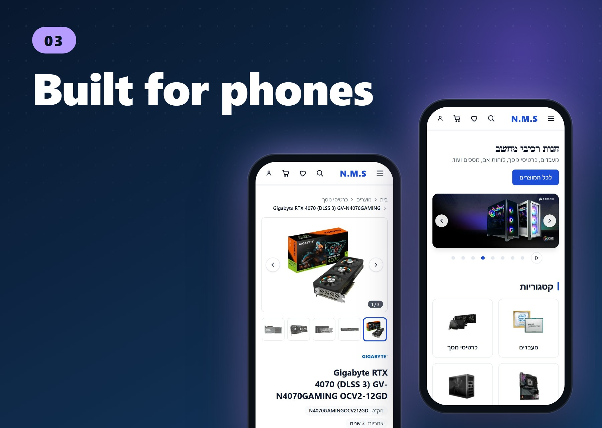
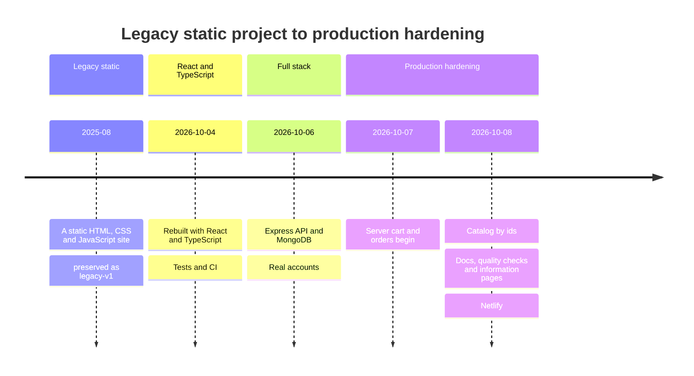
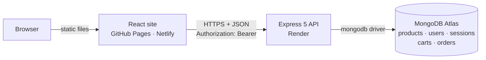
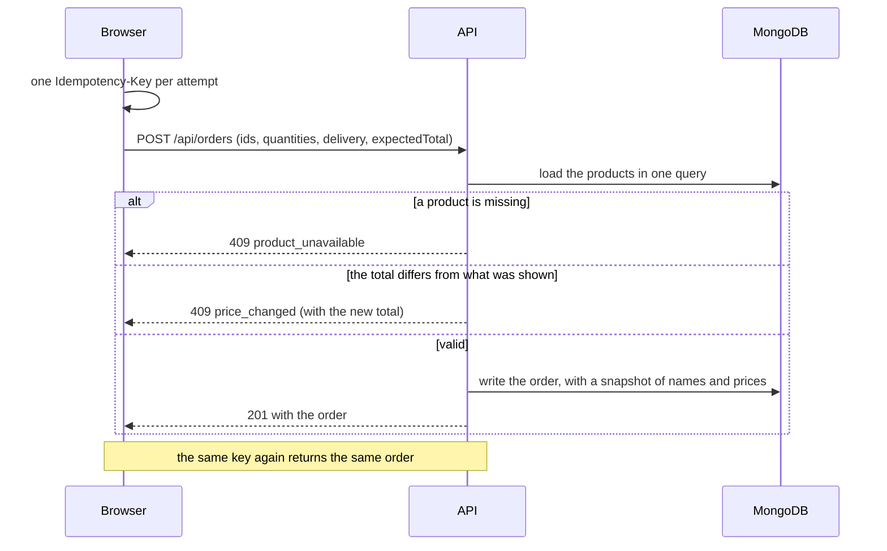
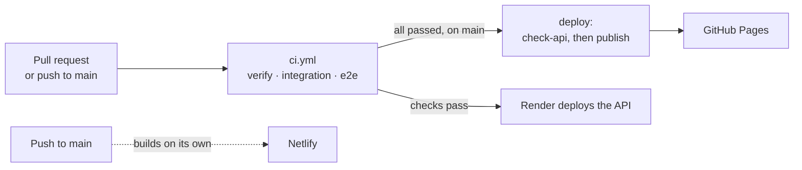

<a id="top"></a>

<div align="center">

# Online Store

**A Hebrew RTL store for PC components, built like a production system.**<br>
A React frontend, an Express API, a real database, and a pipeline that only ships what has passed.

[](https://github.com/Netanel1010/online-store/actions/workflows/ci.yml)


[](LICENSE)

[🚀 **Live demo**](https://netanel1010.github.io/online-store/) ·
[🌐 Second site (Netlify)](https://online-store-netanel.netlify.app/) ·
[🔌 API health](https://online-store-api-9hz8.onrender.com/api/health) ·
[📚 Docs](docs/README.md)

<sub>The API runs on a free Render plan that sleeps when idle, so the first visit after a pause can take about a minute to load the products.</sub>



<sub>Hebrew RTL · React 19 + TypeScript · Express 5 · MongoDB Atlas · 2,450 automated tests</sub>

<p>
  <a href="#take-a-tour">Tour</a> ·
  <a href="#what-makes-it-interesting">Highlights</a> ·
  <a href="#project-evolution">Evolution</a> ·
  <a href="#architecture">Architecture</a> ·
  <a href="#features">Features</a> ·
  <a href="#testing">Testing</a> ·
  <a href="#getting-started">Run it</a> ·
  <a href="#documentation">Docs</a>
</p>

</div>

## Take a tour

<table>
  <tr>
    <td align="center" valign="top"><br><sub>Categories, brands and specification filters,<br>with live result counts</sub></td>
    <td align="center" valign="top"><br><sub>Sale prices, an image gallery,<br>the cart and favorites</sub></td>
    <td align="center" valign="top"><br><sub>Mobile navigation and<br>responsive layouts</sub></td>
  </tr>
</table>

<details>
<summary><b>Try it in two minutes</b></summary>

<br>

Open the [live demo](https://netanel1010.github.io/online-store/) and:

1. **Search** for a part, then narrow the list with the **brand filters**. The URL keeps the state, so you can share it.
2. **Add a few products** to the cart and save one to your favorites.
3. **Create an account** and sign in. Your cart is now kept in the account.
4. **Check out.** The order is a real record, with a number like `DEMO-7K2M9QX4`, but nothing is charged or shipped.
5. Open **My orders** from the account menu, and reload the confirmation page: it is read back from the API.

</details>

## What makes it interesting

|                        | Engineering detail                                                                                                                                     | ADR                                                                                                        |
| ---------------------- | ------------------------------------------------------------------------------------------------------------------------------------------------------ | ---------------------------------------------------------------------------------------------------------- |
| **Server-owned money** | The checkout sends ids and quantities, never prices. The API prices the order, and a stale price comes back as `409 price_changed`.                    | [0005](docs/adr/0005-orders-priced-and-deduplicated-by-the-api.md)                                         |
| **Idempotent orders**  | Every attempt carries an `Idempotency-Key` backed by a unique index, so a retry can never place two orders: a repeated request returns the same order. | [0005](docs/adr/0005-orders-priced-and-deduplicated-by-the-api.md)                                         |
| **Local-first cart**   | It is instant and works offline, and a small engine mirrors it to the account. Signing in merges the carts, and the server uses compare-and-swap.      | [0007](docs/adr/0007-local-first-cart-mirrored-to-the-account.md)                                          |
| **Real API in tests**  | The browser tests talk to a stub that runs the actual API code over in-memory data, not to a hand-written mock.                                        | [0012](docs/adr/0012-tests-run-the-real-api-code.md)                                                       |
| **Deployment gates**   | The site is published only after `verify`, `integration` and `e2e` pass, and the production API is checked first.                                      | [0011](docs/adr/0011-one-workflow-gates-both-deployments.md)                                               |
| **Security**           | scrypt passwords, opaque revocable sessions, an exact CORS allow-list, security headers and rate limits, without extra libraries.                      | [0003](docs/adr/0003-opaque-sessions-and-scrypt.md) · [0010](docs/adr/0010-in-house-limits-and-headers.md) |

## Project evolution

From a static page to a full-stack store, in four steps. The whole story, with the reasons behind each step, is in [`docs/project/05-project-history.md`](docs/project/05-project-history.md) (Hebrew).



The original site is preserved in the [`legacy-v1`](https://github.com/Netanel1010/online-store/tree/legacy-v1) tag.

## Architecture



| Part     | Where                     | Details                                                                                 |
| -------- | ------------------------- | --------------------------------------------------------------------------------------- |
| Site     | GitHub Pages, Netlify     | React + Vite single-page app. GitHub Pages is the primary site, built by GitHub Actions |
| API      | Render (free web service) | Express 5 + TypeScript in [`server/`](server/README.md), deployed from `main`           |
| Database | MongoDB Atlas             | Collections: `products`, `users`, `sessions`, `carts`, `orders`                         |

- **Catalog.** Every page asks the API only for what it shows (search, filters, sorting and paging run in MongoDB). The site never loads the whole catalog.
- **Cart.** It lives in the browser, and signing in merges a cart filled in while signed out with the account's. Details: [`docs/state-persistence.md`](docs/state-persistence.md).

<details>
<summary><b>What happens when you place an order</b></summary>

<br>



</details>

Why it is built this way: [`docs/architecture.md`](docs/architecture.md) and the [decision records](docs/adr/README.md). The API contract: [`docs/openapi.yaml`](docs/openapi.yaml).

## Features

**Core functionality**

<table>
  <tr>
    <td width="33%" valign="top"><b>Catalog</b><br><sub>Hero slider, brands, categories, listings and detail pages</sub></td>
    <td width="33%" valign="top"><b>Search</b><br><sub>Done by the API, with shareable and reloadable URLs</sub></td>
    <td width="33%" valign="top"><b>Filters & sorting</b><br><sub>Brand and specification filters with result counts</sub></td>
  </tr>
  <tr>
    <td valign="top"><b>Cart</b><br><sub>Totals and savings, kept in the account and followed between devices</sub></td>
    <td valign="top"><b>Favorites</b><br><sub>Saved in the browser, with their own page</sub></td>
    <td valign="top"><b>Accounts</b><br><sub>Register, sign in and out, with server-side sessions</sub></td>
  </tr>
  <tr>
    <td valign="top"><b>Demo checkout</b><br><sub>A validated delivery form; the API prices the order</sub></td>
    <td valign="top"><b>Orders</b><br><sub>A confirmation that survives a reload, and "my orders"</sub></td>
    <td valign="top"><b>Information pages</b><br><sub>About, contact, accessibility, privacy and terms</sub></td>
  </tr>
</table>

**UX and quality**

<table>
  <tr>
    <td width="33%" valign="top"><b>Responsive</b><br><sub>Mobile navigation and layouts</sub></td>
    <td width="33%" valign="top"><b>Accessibility</b><br><sub>Keyboard navigation, live regions, automated axe-core checks</sub></td>
    <td width="33%" valign="top"><b>RTL</b><br><sub>Hebrew-first, with logical CSS properties</sub></td>
  </tr>
</table>

<details>
<summary><b>Scope & limitations</b> (what is intentionally not included)</summary>

<br>

The catalog, the accounts, the cart and the orders have a real backend. The checkout is intentionally a demo, and the favorites are intentionally a browser-side feature.

| Limitation               | Details                                                                                                                                       |
| ------------------------ | --------------------------------------------------------------------------------------------------------------------------------------------- |
| **No real payments**     | Nothing is charged, shipped or emailed. Every order is a demo order, and the checkout says so                                                 |
| **Read-only catalog**    | The API cannot create, update or delete products. Changes go through [`products.json`](public/data/products.json) and `npm run seed:products` |
| **One kind of account**  | No administrators, password reset, email confirmation or account page                                                                         |
| **Favorites in browser** | They are not stored in the account                                                                                                            |
| **Cart limits**          | At most 50 different products and 99 units of each. Changes from another device appear at the next sign-in or page load                       |
| **Orders are final**     | An order can be placed and read, not cancelled or edited. There is no way yet to delete an account or its orders                              |
| **No stock or shipping** | Inventory, shipping and tax are outside the project scope                                                                                     |
| **Suggestions wait**     | Search suggestions come from the API a moment after typing pauses, so they are not instant                                                    |

The accounts of the first, browser-only version of the site were never stored on a server and are not carried over.

</details>

## Tech Stack

| Area                | Technology                                                    |
| ------------------- | ------------------------------------------------------------- |
| **Frontend**        | React 19 · TypeScript (strict) · React Router · Vite          |
| **Styling**         | Tailwind CSS 4 · RTL logical properties                       |
| **State & forms**   | Zustand with `persist` · React Hook Form · Zod                |
| **Backend**         | Node.js · Express 5 · TypeScript · Zod                        |
| **Database**        | MongoDB Atlas with the official `mongodb` driver              |
| **Testing**         | Vitest · React Testing Library · Playwright · axe-core        |
| **Code quality**    | ESLint · Prettier                                             |
| **CI/CD & hosting** | GitHub Actions · GitHub Pages · Netlify (site) · Render (API) |

## Testing

<table align="center">
  <tr>
    <td align="center" width="25%"><h3>964</h3><sub>site tests</sub></td>
    <td align="center" width="25%"><h3>1,061</h3><sub>API tests</sub></td>
    <td align="center" width="25%"><h3>96</h3><sub>integration tests</sub></td>
    <td align="center" width="25%"><h3>329</h3><sub>end-to-end tests</sub></td>
  </tr>
</table>

<p align="center"><b>2,450 automated tests</b>, run on every pull request.</p>

| Layer         | Tool                           | Where                       |
| ------------- | ------------------------------ | --------------------------- |
| Unit & UI     | Vitest + React Testing Library | `src/**/*.test.ts(x)`       |
| API           | Vitest (Node)                  | `server/src/**/*.test.ts`   |
| Integration   | Vitest against a real MongoDB  | `**/*.integration.test.ts`  |
| End-to-end    | Playwright                     | `e2e/*.spec.ts`             |
| Accessibility | axe-core + Playwright          | `e2e/accessibility.spec.ts` |

- The API tests need **no MongoDB and no credentials**. The integration tests are skipped unless `MONGODB_TEST_URI` is set, and prove what a fake cannot: the unique indexes, the atomic cart updates and the idempotent orders when requests arrive at the same moment.
- The E2E suite runs against the production build under the `/online-store/` base path, with the GitHub Pages `404.html` fallback. The site talks to a stub API that runs the real API code over in-memory data, so the browser tests need no database either.

> Automated accessibility checks cover only part of accessibility. Passing them does not mean the application is fully WCAG compliant.

More: [`docs/testing.md`](docs/testing.md) · [`docs/accessibility.md`](docs/accessibility.md)

## CI/CD



- **`verify`** runs formatting, linting, TypeScript, the site and API tests, the production build and the weight budget. **`integration`** runs the MongoDB tests against a database that exists only for the job, and **`e2e`** runs Playwright against the production build.
- **`deploy`** runs on `main` only, after all three have passed: it checks the production API with [`scripts/check-api.mjs`](scripts/check-api.mjs) and then publishes the site to GitHub Pages. Render deploys the API from `main` once the same checks pass ([`render.yaml`](render.yaml)).
- **Netlify** builds the second site by itself from `main`. It does not wait for the checks of the repository.

<details>
<summary><b>More about the workflows and the deployment</b></summary>

<br>

Three more workflows run on their own and never block a deployment: `security.yml` (dependency audit and CodeQL), `lighthouse.yml` (accessibility, SEO and layout-shift budgets) and `smoke.yml` (a read-only check of the deployed API and site every night).

Because GitHub Pages cannot rewrite unknown routes, the build generates a `404.html` fallback so that deep links such as `/online-store/cart` or `/online-store/orders/DEMO-7K2M9QX4` work after deployment.

Details: [`docs/deployment.md`](docs/deployment.md) · [`docs/runbook.md`](docs/runbook.md)

</details>

## Getting Started

**1. Prerequisites.** Node.js 24 (the API needs 22.9 or newer; [`.nvmrc`](.nvmrc) names the version), and a MongoDB database to run the site locally (a local MongoDB or a free Atlas cluster). The tests need no database.

**2. Install.**

```bash
npm install
```

**3. Environment.** Point the API at your database in `server/.env` (git-ignored; copy [`server/.env.example`](server/.env.example)), then copy the catalog to the database (once, and again after changing `products.json`):

```ini
MONGODB_URI=mongodb://localhost:27017
MONGODB_DB_NAME=online-store-dev
```

```bash
npm run seed:products
```

**4. Run.** Start the API and the site, each in its own terminal:

```bash
npm run dev:server   # API on http://localhost:3001
npm run dev          # site on the Vite URL shown in the terminal
```

The production API accepts requests only from the deployed sites (CORS), so a local site cannot use it: run the API locally as above. MongoDB setup, Atlas and every API setting: [`server/README.md`](server/README.md).

<details>
<summary><b>Useful commands</b></summary>

<br>

| Command                                    | Purpose                                                                           |
| ------------------------------------------ | --------------------------------------------------------------------------------- |
| `npm run dev` · `npm run dev:server`       | Start the site · start the API with auto-reload                                   |
| `npm run build` · `npm run build:server`   | Type-check and build the site · compile the API                                   |
| `npm run lint` · `npm run typecheck`       | ESLint · TypeScript checks                                                        |
| `npm run format` · `npm run format:check`  | Format with Prettier · check formatting                                           |
| `npm test` · `npm run test:server`         | Site tests · API tests                                                            |
| `npm run test:e2e`                         | Build and run the Playwright tests (first run: `npx playwright install chromium`) |
| `npm run seed:products`                    | Copy the product catalog to MongoDB                                               |
| `npm run check:api` · `npm run check:site` | Check a deployed API · check a deployed site (`SITE_URL`)                         |
| `npm run check:bundle`                     | Check the build against the weight budget of the first page                       |

More commands, the map of the repository and common tasks: [`docs/development.md`](docs/development.md).

</details>

<details>
<summary><b>Configuration</b></summary>

<br>

| Variable                         | Used by | Purpose                                                                                                                          |
| -------------------------------- | ------- | -------------------------------------------------------------------------------------------------------------------------------- |
| `VITE_API_URL`                   | Site    | Where the API is, read **when the site is built**. Defaults to `http://localhost:3001` in development. CI sets it from `API_URL` |
| `VITE_BASE_PATH`                 | Site    | The path the site is served from: `/online-store/` unless set, for example `/` on Netlify ([`netlify.toml`](netlify.toml))       |
| `MONGODB_URI`, `CORS_ORIGINS`, … | API     | Described in [`server/README.md`](server/README.md#configuration). The `MONGODB_URI` secret never goes in a committed file       |

</details>

<details>
<summary><b>Project structure</b></summary>

<br>

```text
src/          The site: app shell, components, features (products, cart, favorites, auth,
              checkout, orders, search, home), layouts, lib, pages, services
server/       Express + TypeScript API (npm workspace, see server/README.md)
e2e/          Playwright specs and support code, including a stub API
public/       Static assets and the product data that the seed copies to MongoDB
scripts/      Build helpers and the production checks (check-api, check-site, bundle budget)
docs/         Architecture, decision records, OpenAPI, runbook, testing, deployment
.github/      Workflows, Dependabot, the pull request template
render.yaml   Render Blueprint of the production API
netlify.toml  Build settings of the second site
```

</details>

## Documentation

The full index, by what you want to do, is [`docs/README.md`](docs/README.md).

| I want to…                              | Read                                                                                                                                |
| --------------------------------------- | ----------------------------------------------------------------------------------------------------------------------------------- |
| understand the system                   | [`docs/architecture.md`](docs/architecture.md) · [`docs/adr/`](docs/adr/README.md) (12 decisions)                                   |
| use the API                             | [`docs/openapi.yaml`](docs/openapi.yaml) · [`server/README.md`](server/README.md)                                                   |
| work on the code                        | [`docs/development.md`](docs/development.md) · [`CONTRIBUTING.md`](CONTRIBUTING.md)                                                 |
| understand the tests and accessibility  | [`docs/testing.md`](docs/testing.md) · [`docs/accessibility.md`](docs/accessibility.md)                                             |
| deploy and operate it                   | [`docs/deployment.md`](docs/deployment.md) · [`docs/runbook.md`](docs/runbook.md)                                                   |
| know how the cart and orders work       | [`docs/state-persistence.md`](docs/state-persistence.md) · [`docs/m9-server-cart-and-orders.md`](docs/m9-server-cart-and-orders.md) |
| read how the project was built (Hebrew) | [`docs/project/`](docs/project/README.md): requirements, design, plan, history, process, technologies                               |
| understand SEO and the catalog data     | [`docs/seo.md`](docs/seo.md) · [`docs/product-data-migration.md`](docs/product-data-migration.md)                                   |

## License

Released under the [MIT License](LICENSE). The licence covers the source code and documentation of this repository. The product names, brands, logos and product images in the catalog are not covered by it: they belong to their owners and appear here only as the content of a demonstration store.

---

<div align="center">

Built by [**Netanel1010**](https://github.com/Netanel1010) as part of Software Engineering studies.

<sub><a href="https://netanel1010.github.io/online-store/">Live demo</a> · <a href="docs/README.md">Docs</a> · <a href="LICENSE">MIT License</a> · <a href="#top">Back to top</a></sub>

</div>
