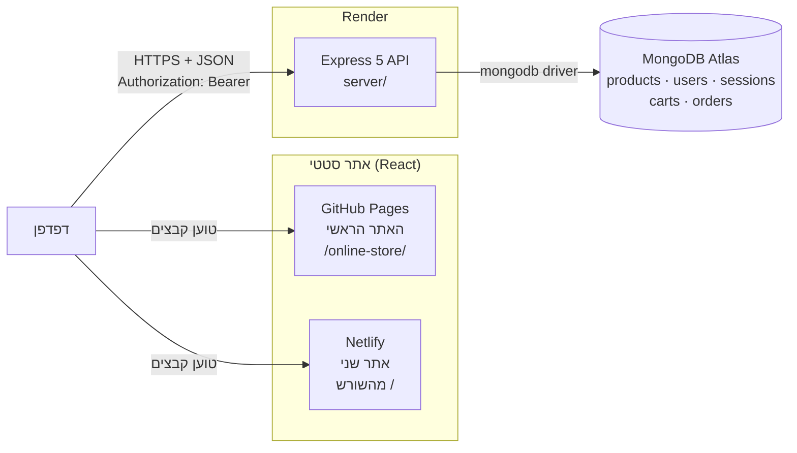
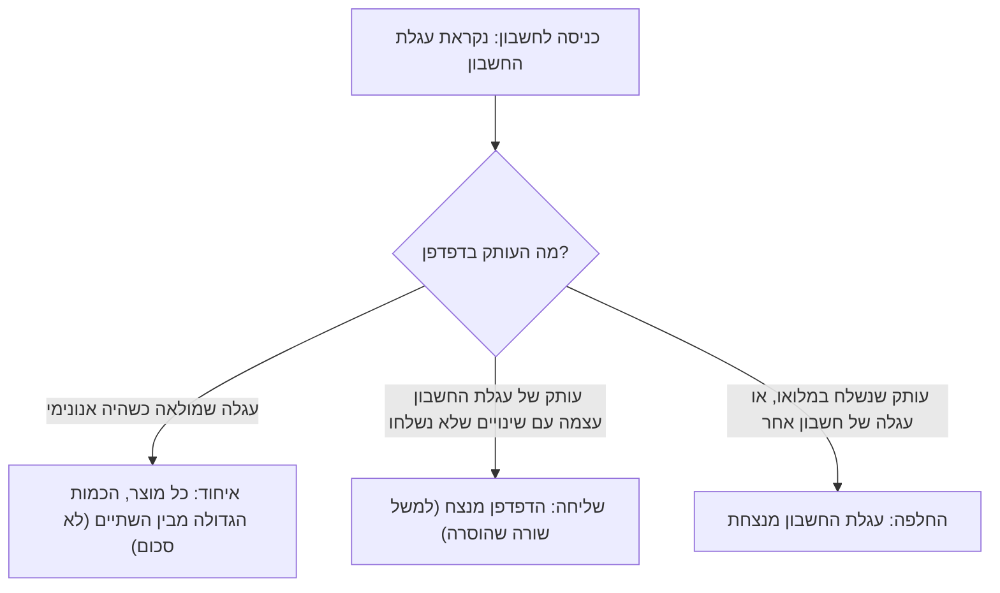
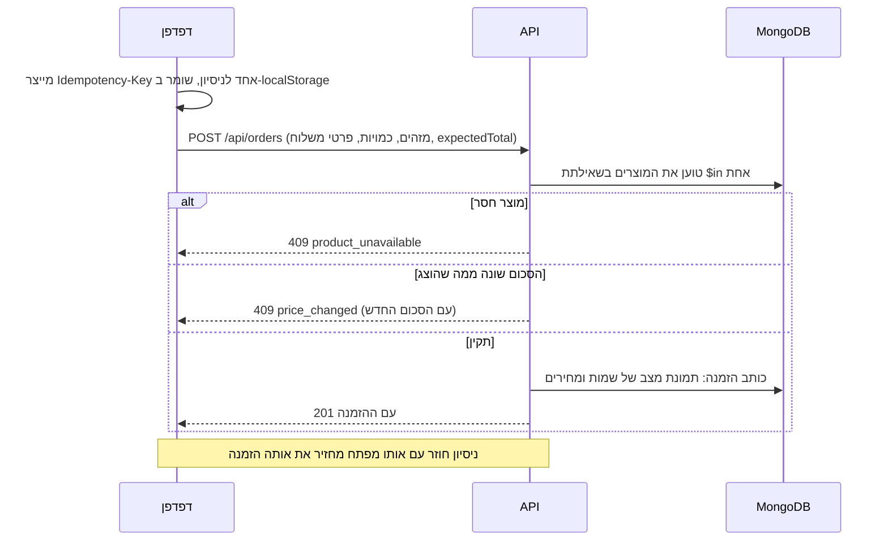
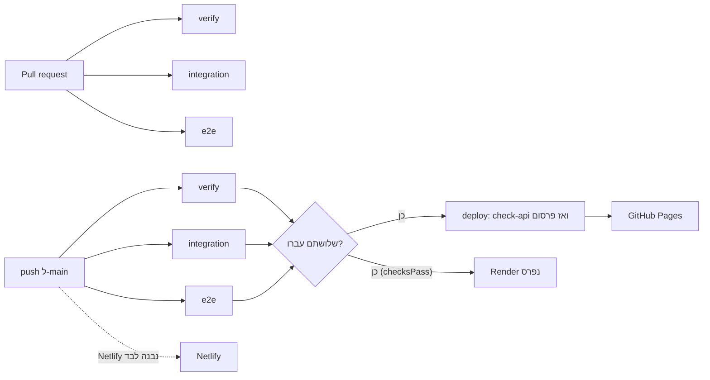

# מסמך עיצוב טכני וארכיטקטורה

המסמך מתאר איך `online-store` בנוי ולמה, כפי שהוא ב-`main` ב-`a7826dd`. הוא מציג את התמונה המלאה
ברמת תכנון ומקשר לפירוט שכבר קיים, ולא משכפל אותו:

- הפירוט הטכני, עם שמות הקבצים: [`../architecture.md`](../architecture.md)
- החוזה של ה-API: [`../openapi.yaml`](../openapi.yaml) ו-[`../../server/README.md`](../../server/README.md)
- ההחלטות: [`../adr/`](../adr/README.md)
- הפריסה והתפעול: [`../deployment.md`](../deployment.md), [`../runbook.md`](../runbook.md)

הטענות כאן נבדקו מול הקוד והתצורה (`[Code]`, `[Config]`). כשרכיב נוסף בשלב מסוים, מצוין הקוד של
השלב (ראו [README](README.md#מינוח-שתי-מערכות-מספור)).

## 1. סקירת המערכת



שלושה חלקים נפרדים, כל אחד נפרס לבדו:

| חלק         | טכנולוגיה                                                | היכן בקוד                                 | נפרס אל                       |
| ----------- | -------------------------------------------------------- | ----------------------------------------- | ----------------------------- |
| האתר        | React 19, TypeScript, Vite, Tailwind CSS 4, Zustand      | `src/`, `public/`, `index.html`           | GitHub Pages (ראשי) ו-Netlify |
| ה-API       | Node.js, Express 5, TypeScript, Zod, מנהל התקן `mongodb` | `server/` (npm workspace)                 | Render, לפי `render.yaml`     |
| מסד הנתונים | MongoDB                                                  | אין קוד משלו; ה-API יוצר אינדקסים בעלייתו | MongoDB Atlas                 |

האתר וה-API חולקים **מאגר אחד והתקנה אחת**, וגם **קוד**: ה-API מייבא מ-`src/` את סכמת Zod של המוצר,
רשימות המותגים והקטגוריות, כללי החיפוש וכללי העגלה, המשלוח והסיסמה, כדי שכל כלל ייכתב פעם אחת
(ADR 0004).

## 2. גבולות הרכיבים

| רכיב                                    | אחראי על                                                                    | לא אחראי על                       |
| --------------------------------------- | --------------------------------------------------------------------------- | --------------------------------- |
| עמוד (`src/pages/`)                     | הרכבת תכונות לדף אחד                                                        | לוגיקה עסקית; הוא "לא מחזיק כלום" |
| תכונה (`src/features/<x>/`)             | ההתנהגות של תחום: מוצרים, עגלה, אימות, הזמנות, חיפוש וכו'                   | עיצוב משותף                       |
| `services/`, `lib/`                     | בקשות ל-API ואימות התשובה, בקשות עם ניסיון חוזר, SEO, עיצוב                 | מצב                               |
| `routes.ts` (ב-API)                     | HTTP בלבד: קריאת בקשה, קריאה לשירות, שליחת תשובה                            | כללים                             |
| `service.ts`                            | הכללים: תמחור, מיזוג, מגבלות, משמעות "לא קיים". אין בו HTTP ואין בו MongoDB | גישה למסד                         |
| `repository.ts`                         | הקוד היחיד שמכיר MongoDB: שאילתות ואינדקסים                                 | כללים                             |
| `render.yaml`, `netlify.toml`, `ci.yml` | פריסה                                                                       | קוד אפליקציה                      |

הפיצול לשלוש שכבות ב-API הוא מה שמאפשר לבדוק כל תכונה בלי מסד נתונים, עם repository בזיכרון
(`server/src/testing/`).

## 3. ארכיטקטורת הלקוח (Frontend)

| נושא        | מה קיים                                                                                         | הערות                                                                                              |
| ----------- | ----------------------------------------------------------------------------------------------- | -------------------------------------------------------------------------------------------------- |
| בנייה       | Vite 8, TypeScript strict (`noUncheckedIndexedAccess`), ESLint ו-Prettier                       | `postbuild` כותב `404.html` ועמודי SEO סטטיים                                                      |
| עיצוב       | Tailwind CSS 4, כיוון RTL עם מאפיינים לוגיים                                                    | `lang="he" dir="rtl"`                                                                              |
| ניתוב       | React Router, `BrowserRouter` עם `base`                                                         | `/online-store/` כברירת מחדל; `VITE_BASE_PATH` מאפשר `/` (Netlify), ומאומת ב-`scripts/basePath.ts` |
| מצב         | שלושה חנויות Zustand עם `persist`: סשן, עגלה, מועדפים; ועוד סמן סנכרון עגלה                     | נשמרים מזהים בלבד (ADR 0006); כל קריאה מ-`localStorage` מאומתת ב-Zod                               |
| טפסים       | React Hook Form + Zod                                                                           | התחברות, הרשמה, פרטי משלוח                                                                         |
| גישה ל-API  | `fetchWithRetry`: 30 שניות לניסיון, עד שלושה ניסיונות, רק על כשל חיבור, timeout, או 502/503/504 | רק בקשות בטוחות לחזרה: קריאות, `PUT`/`DELETE` של העגלה, ו-POST של הזמנה עם `Idempotency-Key`       |
| טעינת קטלוג | כל עמוד מבקש רק את מה שהוא מציג (ADR 0009)                                                      | רשימות, מוצר בודד, `ids`, `sale`, `recommended`, `categories`                                      |
| מעטפת       | `RootLayout`: כותרת, כותרת תחתונה, גבול שגיאות לעמוד, וסנכרון העגלה (`KeepCartSynced`)          | גבול שגיאות נוסף סביב ה-router                                                                     |
| עמודי מידע  | רשימה אחת, `src/lib/infoPages.ts`, מזינה נתיבים, כותרת תחתונה, מטא-דאטה, HTML סטטי ו-sitemap    | אודות, יצירת קשר, נגישות, פרטיות, תנאי שימוש                                                       |
| ניווט מוגן  | `RequireAuth` על `checkout` ו-`orders`                                                          | רק חוויה: ההרשאה נקבעת ב-API                                                                       |

**מצב האימות בלקוח:** המכונה היא `restoring`, `authenticated`, `anonymous`, `unavailable`. האסימון, תאריך
הסיום והמשתמש נשמרים תחת המפתח `online-store:session`.

פירוט המפתחות והקבצים: [`../architecture.md`](../architecture.md#the-site-src),
[`../state-persistence.md`](../state-persistence.md).

## 4. ארכיטקטורת ה-Backend

`createApp()` ב-`app.ts` בונה את האפליקציה בלי להפעיל אותה, ו-`server.ts` הוא המקום היחיד שמאזין:
הוא טוען ומאמת תצורה, **מתחבר ל-MongoDB לפני שהוא מקשיב**, ונסגר בצורה מסודרת על `SIGTERM`.

סדר ה-middleware: מזהה בקשה ויומן, כותרות אבטחה, timeout של 25 שניות לתשובה, CORS, JSON (עד
100 kB), הנתיבים תחת `/api`, 404 בפורמט JSON, ומטפל השגיאות.

| תכונה      | נתיבים                                                                | הערה                                                                                        |
| ---------- | --------------------------------------------------------------------- | ------------------------------------------------------------------------------------------- |
| `health`   | `GET /api/health`, `GET /api/health/ready`                            | הראשון לא נוגע במסד; השני כן. ההפרדה מונעת מ-Render להפעיל מחדש שרת תקין בגלל תקלת מסד קצרה |
| `products` | `GET /api/products`, `GET /api/products/:id`, `GET /api/categories`   | קריאה בלבד; חיפוש, סינון, מיון ועימוד ב-MongoDB                                             |
| `auth`     | `/api/auth/register`, `login`, `logout`, `logout-all`, `me`           | סשנים, scrypt, הגבלות קצב                                                                   |
| `cart`     | `/api/cart`, `/api/cart/items`, `/api/cart/items/:productId`          | עגלה אחת לחשבון                                                                             |
| `orders`   | `POST /api/orders`, `GET /api/orders`, `GET /api/orders/:orderNumber` | תמחור בשרת, תמונת מצב קבועה                                                                 |

התצורה מאומתת ב-Zod בעלייה. `CORS_ORIGINS` ו-`MONGODB_URI` **חובה בייצור**, כדי שערכי ברירת המחדל
המקומיים לעולם לא יחולו בטעות על שרת פרוס (#43, #44). בלי `MONGODB_URI` (פיתוח ובדיקות בלבד) ה-API
עולה ומחזיר `503 database_not_configured` בכל נתיב שצריך נתונים.

## 5. ארכיטקטורת ה-API

| היבט               | עיצוב                                                                                                                                                                                                                                                                                                                          |
| ------------------ | ------------------------------------------------------------------------------------------------------------------------------------------------------------------------------------------------------------------------------------------------------------------------------------------------------------------------------ |
| סגנון              | REST ב-JSON תחת `/api`. **אין גרסה בנתיב** (`/api` ללא `/v1`). בביקורת המוכנות סומן שיש להחליט על גרסאות לפני נתיב כתיבה חדש `[Notes]`. בפועל לא נוספה גרסה, ולא נמצאה החלטה מתועדת בנושא                                                                                                                                      |
| צורת שגיאה         | תמיד `{ "error": { "code", "message" } }`; ב-5xx גם `requestId`; ובמקום ש-client יכול לפעול, גם `details`                                                                                                                                                                                                                      |
| קודי שגיאה עיקריים | `invalid_json`, `invalid_query`, `invalid_pagination`, `product_not_found`, `unauthorized`, `invalid_credentials`, `email_taken`, `rate_limited`, `server_busy`, `request_timeout`, `database_not_configured`, `product_unavailable`, `price_changed`, `idempotency_key_reuse`, `cart_full`, `cart_conflict`, `internal_error` |
| מטמון              | קריאות מוצרים: `public, max-age=60, stale-while-revalidate=3600`; כל מה שקשור לחשבון וכל שגיאה: `no-store`                                                                                                                                                                                                                     |
| CORS               | רשימת היתר מדויקת; שיטות `GET, HEAD, POST, PUT, DELETE`; כותרות `Authorization, Content-Type, Idempotency-Key`; חשופות `Retry-After, X-Request-Id`; preflight ל-600 שניות; ללא credentials                                                                                                                                     |
| חוזה               | 18 פעולות ב-OpenAPI 3.1 (`docs/openapi.yaml`). אין בדיקה אוטומטית שה-OpenAPI תואם לקוד                                                                                                                                                                                                                                         |

## 6. עיצוב מסד הנתונים

מסד אחד (`online-store`), חמש אוספים. אין מיגרציות: ה-API יוצר אינדקסים בעלייתו.

| אוסף       | מסמך          | שדות מפתח ואינדקסים                                                                                                                                                             |
| ---------- | ------------- | ------------------------------------------------------------------------------------------------------------------------------------------------------------------------------- |
| `products` | מוצר          | שדות סכמת Zod, ועוד אובייקט `search` עם טקסט מנורמל (לא מוחזר ללקוח); `id` ייחודי                                                                                               |
| `users`    | חשבון         | `id` (UUID), `email` באותיות קטנות, `passwordHash`; `id` ו-`email` ייחודיים                                                                                                     |
| `sessions` | דפדפן מחובר   | `tokenHash` (SHA-256), `userId`, `createdAt`, `expiresAt`; `tokenHash` ייחודי, TTL על `expiresAt`, `{ userId, createdAt }`                                                      |
| `carts`    | עגלת חשבון    | `userId`, `items[{ productId, quantity }]`, `revision`, `updatedAt`; `userId` ייחודי                                                                                            |
| `orders`   | הזמנה (קבועה) | `orderNumber`, `userId`, `idempotencyKey`, `requestHash`, `lines`, `total`, `delivery`; `orderNumber` ייחודי, `{ userId, idempotencyKey }` ייחודי, `{ userId, createdAt, _id }` |

**מודל הנתונים של הקטלוג:** `public/data/products.json` הוא המקור. `npm run seed:products` מאמת
ומבצע upsert לפי `id` ולעולם לא מוחק, ולכן מוצר שהוסר מהקובץ נשאר ב-MongoDB, ו-`check:api` מדווח
על כך (#64).

**חיפוש בעברית:** MongoDB לא יכול לנרמל טקסט בעברית תוך כדי חיפוש. לכן כל מוצר נשמר עם הטקסט המנורמל
של שדותיו ($regex אחד לכל מילה), וה-API ממלא אותו בעלייה למוצרים שחסר להם, כך שאין צורך ב-seed מחדש
(#49, ADR 0008). **לא נוצרו אינדקסים לחיפוש**: שאילתות לא-מעוגנות על קטלוג קטן, שאף אינדקס לא ישרת.

## 7. מודל האימות

```text
register / login ──► ה-API בודק קלט וסיסמה (scrypt, השוואה בזמן קבוע)
                     יוצר סשן: אסימון אקראי של 256 ביט; נשמר רק ה-SHA-256 שלו
                 ◄── { user, token, expiresAt }     (האסימון מוצג פעם אחת)

כל בקשה אחר כך: Authorization: Bearer <token>
                 ה-API מבצע hash לאסימון, מוצא סשן חי (לא נגמר, לא פג), וטוען את החשבון
```

| החלטה             | פירוט                                                                                                                                  | מקור                        |
| ----------------- | -------------------------------------------------------------------------------------------------------------------------------------- | --------------------------- |
| אסימון ולא cookie | האתר וה-API אתרים שונים, ו-cookie היה צד שלישי שחוסמים; אין צורך ב-CSRF וב-`credentials`                                               | ADR 0002, #50               |
| סשן אטומי ולא JWT | ניתן לביטול בשרת, אין סוד חתימה                                                                                                        | ADR 0003                    |
| סיסמאות           | scrypt מ-`node:crypto` (N=2^15, r=8, p=3, מלח אקראי); 8–128 תווים עם אות וספרה; hash דמה כך ששליפת אימייל לא קיים עולה כמו סיסמה שגויה | #50, `passwords.ts`         |
| תוקף              | 7 ימים                                                                                                                                 | `SESSION_TTL_MS`            |
| תקרה              | עד 10 סשנים לחשבון (הישן נגמר בכניסה הבאה); `POST /api/auth/logout-all` מסיים את כולם                                                  | `MAX_SESSIONS_PER_USER`, M8 |
| תגובה אחידה       | אימייל לא קיים וסיסמה שגויה מחזירים אותה תשובה                                                                                         | #50                         |

**מחיר מוכר:** האסימון ב-`localStorage`, כך ש-XSS יכול לקרוא אותו. המיתון: תוקף קצר, ביטול בשרת,
ורינדור טקסט כטקסט (#50).

## 8. מודל ההרשאות

סוג חשבון אחד, בלי תפקידים. נתיב מוגן ע"י `createRequireAuth` לפניו; מזהה החשבון נלקח **רק מהסשן**.
שום נתיב לא מקבל `userId` בגוף או ב-URL. הזמנה של מישהו אחר או לא קיימת מחזירה `404` בשניהם, כדי
שלא יהיה אפשר לחשוף קיומה. `RequireAuth` באתר הוא חוויה בלבד, וה-API הוא שמחליט.

## 9. ארכיטקטורת העגלה

העגלה היא **local-first ומשוכפלת לחשבון** (ADR 0007):

- הדפים קוראים ומשנים את העגלה ב-`localStorage` (Zustand), ולכן היא מיידית ועובדת בלי רשת.
- למחובר, מנוע (`features/cart/cartSync.ts`) משקף אותה אל `/api/cart` כ-400ms אחרי שינוי, ושולח רק
  שורות ששונו, ומנסה שוב כשה-API לא זמין (5, 15 ו-45 שניות, ואז 45).
- בכניסה, שלושה מצבים לפי הסמן (`online-store:cart-sync`):



- ביציאה, העגלה בדפדפן מתרוקנת (מחשבים משותפים) והחשבון שומר את שלו.
- מגבלות: 99 יחידות לשורה, עד 50 מוצרים שונים (`409 cart_full`); מה שנשמר בשרת הוא מזהה וכמות בלבד.
- בשרת, כל שינוי הוא compare-and-swap על שדה `revision`; הפסיד קורא מחדש ומנסה שוב, ורק אחרי חמש
  התנגשויות רצופות מוחזר `409 cart_conflict`.

## 10. ארכיטקטורת ההזמנות



- **מחיר ושמות מהשרת:** הלקוח שולח מזהים, כמויות, פרטי משלוח, `expectedTotal` ומפתח; לא מחיר ולא שם.
- **מספר הזמנה:** נוצר בשרת באמצעות `crypto.randomInt`, בפורמט `DEMO-XXXXXXXX` (קידומת `DEMO-` כל עוד
  אין תשלום); אינדקס ייחודי וניסיון חוזר בהתנגשות.
- **ההזמנה קבועה:** אין עדכון, ביטול או מחיקה.
- **אחרי הצלחה:** העגלה מתרוקנת, ומנוע הסנכרון שולח את זה כשינוי רגיל. ההזמנה נקראת מה-API גם אחרי
  רענון בכתובת `/orders/:orderNumber`, ולא נשמרת ב-router state.
- **דמו בלבד:** שום דבר לא נגבה, נשלח או נשלח באימייל.

## 11. עקביות נתונים

אין טרנזקציות של MongoDB: הן לא זמינות בשירות שמשמש ב-CI, ולא נחוצות, כי הזמנה ועגלה הן מסמך אחד.
העקביות נשענת על אינדקסים ייחודיים ועל גרסה:

| סיכון                                        | הגנה                                                                                                                                     |
| -------------------------------------------- | ---------------------------------------------------------------------------------------------------------------------------------------- |
| ניסיון חוזר או לחיצה כפולה יוצרים שתי הזמנות | `Idempotency-Key` עם אינדקס ייחודי `{ userId, idempotencyKey }`; אותו מפתח עם גוף שונה הוא `409 idempotency_key_reuse` (ה-`requestHash`) |
| הלקוח מציג מחיר ישן (המטמון עד שעה)          | השרת קובע את המחיר; `expectedTotal` מזהה פער ומחזיר `409 price_changed`                                                                  |
| מוצר שהוסר מהקטלוג                           | `409 product_unavailable`; לא נושר בשקט                                                                                                  |
| שתי לשוניות משנות עגלה בו-זמנית              | compare-and-swap על `revision`                                                                                                           |
| שני אנשים מקבלים אותו מספר הזמנה             | אינדקס ייחודי, וניסיון חוזר                                                                                                              |
| נתונים לא אמינים בדפדפן                      | אימות Zod בטעינה; מזהים שאינם קיימים מוסרים (`ShopStateReconciler`)                                                                      |
| קטלוג בקובץ שונה מהמסד                       | `check:api` משווה ומדווח (אזהרה ב-deploy, שגיאה עם `STRICT_HARDENING=1`)                                                                 |

## 12. טיפול בשגיאות

- **API:** מטפל שגיאות אחד. שגיאה צפויה היא `HttpError`; כל שגיאה אחרת נרשמת עם stack ונענית
  `500 internal_error` גנרי, כך שפרטים פנימיים לא דולפים. כל שגיאה היא `no-store`.
- **לקוח:** גבול שגיאות סביב העמוד (הכותרות נשארות) ועוד אחד אחרון סביב ה-router. עמוד שלא נטען אחרי
  פריסה חדשה מציע טעינה מחדש, כי ניסיון חוזר לא יעזור (`lib/chunkError.ts`); שגיאת רינדור אחרת מציעה
  "נסו שוב" וקישור הביתה ואומרת שהעגלה בטוחה.
- **רשת:** הודעת "השרת אולי מתעורר" אחרי ארבע שניות בטעינה ארוכה (`SlowLoadNotice`), ו-timeout וניסיון
  חוזר.

## 13. מודל האבטחה

| עניין                | אמצעי                                                                                                 |
| -------------------- | ----------------------------------------------------------------------------------------------------- |
| מי רשאי לקרוא מדפדפן | CORS מדויק (`CORS_ORIGINS`), חובה בייצור                                                              |
| ניחושים והצפה        | הגבלות קצב לפי כתובת, 5 כשלונות כניסה לאימייל, ושער של 2 הצפנות במקביל עם 8 ממתינות                   |
| איזו כתובת נספרת     | `TRUST_PROXY_HOPS` (2 בייצור), נקרא מימין ל-`X-Forwarded-For`                                         |
| כותרות               | `nosniff`, `Referrer-Policy: no-referrer`, CSP שלא מתיר דבר, `X-Frame-Options: DENY`, HSTS רק ב-HTTPS |
| תקלות איטיות         | timeout של 25 שניות; keep-alive של 65 שניות, כותרות 66, בקשה 120                                      |
| קלט                  | Zod על כל גוף ושאילתה; הודעת שגיאה מציינת שדה ולא ערך; גוף עד 100 kB                                  |
| סודות                | `MONGODB_URI` רק בלוח הבקרה של Render; יומנים מסירים סודות; בדיקת מאגר לסוד                           |
| תלויות וקוד          | `npm audit`, CodeQL, Dependabot, הצמדת Actions                                                        |
| רגרסיה בייצור        | `check-api.mjs` בודק את ה-API הפרוס לפני פרסום האתר, ובלילה                                           |

**מגבלות:** ההגבלות בזיכרון תהליך (ADR 0010), ולאתר ב-GitHub Pages אין CSP כי הוא לא שולח כותרות.

## 14. ארכיטקטורת הבדיקות

| שכבה        | כלי                                                          | מה היא מוכיחה                                                              |
| ----------- | ------------------------------------------------------------ | -------------------------------------------------------------------------- |
| יחידה ורכיב | Vitest + React Testing Library (jsdom)                       | לוגיקה והתנהגות מהירות                                                     |
| API         | Vitest (Node)                                                | נתיבים, שירותים ושכבת ה-repository על נתונים בזיכרון, בלי MongoDB          |
| אינטגרציה   | Vitest מול MongoDB אמיתי (בשירות זמני ב-CI)                  | אינדקסים ייחודיים, עדכונים אטומיים, הזמנות אידמפוטנטיות תחת בו-זמניות      |
| דפדפן (e2e) | Playwright (Chromium) על build הייצור, מוגש כמו GitHub Pages | מה ש-jsdom לא יכול: פריסה, היסטוריה, `localStorage` אמיתי, מיקוד, ניגודיות |
| נגישות      | axe-core דרך Playwright                                      | בדיקה אוטומטית בלבד; לא הוכחה לעמידה בתקן                                  |
| איכות       | `check:bundle`, Lighthouse CI, בדיקת עשן לילית               | תקציב משקל, ציונים, זמינות ייצור                                           |

העיקרון המארגן הוא ש**בדיקות האתר וה-e2e מריצות את קוד ה-API האמיתי** על נתונים בזיכרון, ולא mock
כתוב ביד (ADR 0012), כך שהחוזה נבדק באמת. דפדפן שנכשל בבקשה או בקונסול נכשל (safety net), פרט
לביטול מכוון (`ERR_ABORTED`) שהדף עצמו דיווח עליו (M1).

## 15. ארכיטקטורת הפריסה

### מצב נוכחי

| חלק        | היכן                                               | כתובת                                         | הערה                                  |
| ---------- | -------------------------------------------------- | --------------------------------------------- | ------------------------------------- |
| האתר הראשי | GitHub Pages                                       | `https://netanel1010.github.io/online-store/` | נפרס מ-`ci.yml` אחרי הבדיקות          |
| האתר השני  | Netlify                                            | `https://online-store-netanel.netlify.app/`   | נבנה על ידי Netlify, מ-`main`, מהשורש |
| ה-API      | Render, `online-store-api`, פרנקפורט, חבילה חינמית | `https://online-store-api-9hz8.onrender.com`  | נפרס מ-`main` כש-CI עובר              |
| מסד נתונים | MongoDB Atlas                                      | נגיש רק מה-API                                | תוכנית הגיבוי והחבילה: Not documented |

ב-`render.yaml`: `CORS_ORIGINS` מכיל את שתי הכתובות (`https://netanel1010.github.io` ו-
`https://online-store-netanel.netlify.app`). בדיקה חיה ב-2026-10-08, בזמן כתיבת המסמך, הראתה
שה-API מחזיר `access-control-allow-origin` לשני המקורות, ושני האתרים עונים `200`.

### למה שני אתרי frontend

**הסיבה (`[Owner]`):** הדגמת פריסה לפלטפורמה נוספת. הדרישות שנקבעו להוספה `[Notes]`: GitHub Pages
נשאר ראשי ועובד ללא שינוי, Netlify הוא פריסה נוספת של אותו אתר, מועדפת חבילה חינמית, ו-"Do not change
production behavior just to support Netlify".

המימוש (#69) הוא מינימלי:

- `VITE_BASE_PATH` קובע את ה-`base` של build ייצור. בלי הערך הוא נשאר `/online-store/`, וכל build של
  GitHub Pages זהה בבייטים לקודם (678 קבצים, 0 הבדלים `[PR #69]`).
- `netlify.toml` מגדיר build (`npm run build`), `publish = "dist"`, `VITE_BASE_PATH="/"` ו-`VITE_API_URL`.
  גרסת Node נלקחת מ-`.nvmrc`.
- הכתובות הקנוניות, `og:url` וה-sitemap **ממשיכים להצביע ל-GitHub Pages** (הן נקבעות לפי `SITE_URL`
  ב-`src/lib/seo.ts`, לא לפי ה-base), כך שאין תוכן כפול בין האתרים בעיני מנועי חיפוש.

**התוצאות של בחירה בשני אתרים:**

| תוצאה                           | פירוט                                                                                           |
| ------------------------------- | ----------------------------------------------------------------------------------------------- |
| ה-API חייב לאפשר את שני המקורות | ללא כך Netlify נטען ולא מציג מוצרים (נפתר בקומיט השני של #69)                                   |
| סשן לפי מקור (origin)           | משתמש מתחבר בנפרד בכל אתר. חשבונות, עגלות והזמנות משותפים כי הם ב-API                           |
| Netlify לא כפוף ל-CI של המאגר   | Netlify נבנה מעצמו ב-push ל-`main` ואינו מחכה ל-`verify`, `e2e`, `integration` או ל-`check-api` |
| Deploy previews                 | מקבלים שמות מארח אחרים שאינם ב-CORS, ולכן לא יוכלו לקרוא ל-API                                  |
| עמודי המידע                     | אודות ופרטיות מציינים ששני האתרים מארחים את האתר ושלכל אחד עשויים להיות יומני גישה              |

## 16. CI/CD



| Workflow                | מתי                | מה                                                                          |
| ----------------------- | ------------------ | --------------------------------------------------------------------------- |
| `ci.yml`: `verify`      | PR ו-push ל-`main` | format, lint, typecheck, בדיקות אתר ו-API, build אתר, תקציב משקל, build API |
| `ci.yml`: `integration` | PR ו-push ל-`main` | בדיקות MongoDB מול `mongo:8.0` זמני                                         |
| `ci.yml`: `e2e`         | PR ו-push ל-`main` | Playwright על build הייצור ו-API stub                                       |
| `ci.yml`: `deploy`      | רק `main`          | `check-api.mjs` מול הייצור (אם `API_URL` מוגדר), ואז GitHub Pages           |
| `security.yml`          | PR, `main`, שבועי  | `npm audit --omit=dev --audit-level=high`, CodeQL                           |
| `lighthouse.yml`        | PR ו-`main`        | תקציבי נגישות, SEO, best practices ו-CLS                                    |
| `smoke.yml`             | כל לילה ולפי דרישה | `check-api` במצב strict ו-`check-site`, לקריאה בלבד                         |

רק `ci.yml` הוא שער פריסה. האחרים אינם שער בכוונה (ADR 0011): תקלה בצד ג' או זמן על runner משותף לא
אמורים להחליט אם commit ייפרס. כל ה-Actions מוצמדים ל-commit, וגרסת Node נלקחת מ-`.nvmrc`.

## 17. תצפיתיות

ה-API כותב שורת JSON אחת לכל בקשה (שיטה, נתיב בלי query, סטטוס, משך, כתובת לקוח; בדיקות health
מוצלחות מדולגות) ושורת `error` עם stack. כל תשובה נושאת `X-Request-Id`, ו-5xx נושא אותו מזהה כ-
`requestId`, כך שאפשר למצוא דיווח של מבקר ביומני Render. סודות מוסרים לפני כתיבה (סיסמאות, אסימונים,
מחרוזות חיבור, שדות כמו `authorization` ו-`cookie`). אין מדדים ואין התראות, ושמירת היומנים תלויה ב-
Render.

## 18. נגישות

בדיקות axe אוטומטיות על העמודים והמצבים, ובדיקות מקלדת ומיקוד; קישור דילוג, מיקוד ל-`main` אחרי
ניווט, אזורי live להודעות, ותפריט נייד כדיאלוג מודאלי. מעבר מקלדת ידני בוצע ב-M12 ללא ממצא. **לא נבדק:**
קורא מסך, זום, ניגודיות גבוהה, Firefox ו-Safari. הצהרת הנגישות באתר לא טוענת לעמידה בתקן
(`docs/accessibility.md`).

## 19. SEO ועמודים סטטיים

GitHub Pages מחזיר `404.html` לכל כתובת בלי קובץ, ורוב הסורקים לא מריצים את האפליקציה. לכן
`scripts/static-routes.mjs` (שרץ ב-`postbuild`) מעתיק את ה-HTML לכל עמוד שכדאי לאנדקס (הבית, הרשימה,
עמודי המידע, כל קטגוריה, כל מוצר) וכותב אליו כותרת, תיאור, כתובת קנונית, Open Graph ונתונים
מובנים, וכן `sitemap.xml`. הקבצים נוצרים מ-`products.json` דרך אותה סכמה ש-ה-seed משתמש בה, ולא
נשמרים ב-Git. תוצאות חיפוש, עגלה, מועדפים, כניסה, הרשמה, checkout ושגיאות מקבלים `noindex`. אין
`robots.txt`, כי סורקים קוראים אותו רק בשורש המארח (`docs/seo.md`).

## 20. תהליך Git

עבודה בענף ייעודי לכל משימה, ללא עבודה ישירה על `main`, PR עם תבנית, CI לפני מיזוג, מיזוג ב-merge
commit, והודעות commit בסגנון Conventional Commits. הנימוקים וההתפתחות: [`07-engineering-process.md`](07-engineering-process.md).

## 21. איך העיצוב התפתח

העיצוב לא נקבע מראש. הוא נבנה בשכבות, וכל שכבה נשענה על זו שלפניה:

| שלב         | מה נוסף                                                                                                       | נשען על                                   |
| ----------- | ------------------------------------------------------------------------------------------------------------- | ----------------------------------------- |
| `MS1`–`MS2` | אתר React מקובץ נתונים סטטי, כשכל גישה לנתונים עוברת ב-`productService` ("single seam for a future API", #19) | הקוד הישן ב-`legacy-v1`                   |
| `MS3`–`MS5` | מצב בדפדפן ואימות דמו                                                                                         | `productService`                          |
| `MS6`       | בדיקות דפדפן                                                                                                  | כל מה שלפניו                              |
| `BE`        | API ומסד נתונים; ה-`seam` מוחלף בבקשות אמיתיות                                                                | הסכמה המשותפת                             |
| `SV`        | חיפוש ואימות בשרת                                                                                             | ה-API                                     |
| `M1`–`M8`   | הקשחה, תצפיתיות, CI אמיתי למסד, חוסן                                                                          | ה-API ו-CI                                |
| `M9`        | עגלה והזמנות בשרת                                                                                             | אימות, הקשחה, CORS                        |
| `M10`       | קטלוג לפי מזהים                                                                                               | `M9` (הדפים שצורכים מוצרים בעגלה ובהזמנה) |
| `M11`–`NT`  | תיעוד, איכות, עמודי מידע, אתר שני                                                                             | המערכת המלאה                              |

הסיפור המלא והנימוקים: [`05-project-history.md`](05-project-history.md).
