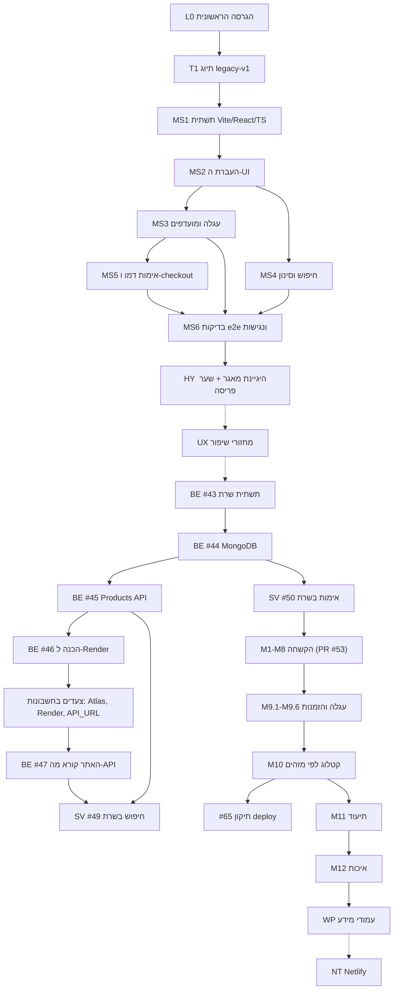

# תלויות וחסמים

המסמך עונה על שלוש שאלות: מה היה חייב לקרות לפני מה, מה לא היה תלוי בדבר, ומה חסם בפועל את
העבודה. הוא מופיע לפני [תכנית הפרויקט](04-project-plan.md) כי התכנית נשענת עליו.

**כלל:** רשומה כאן רק תלות שיש לה ראיה: טקסט ב-PR, שדה "Depends on" בתכנית, סדר ה-commits ב-Git, או
קוד. כשהתלות נראית הגיונית אבל אין לה ראיה, היא מסומנת
`Engineering rationale inferred from the implementation.`

## 1. סוגי תלויות

| סוג    | משמעות                                                        |
| ------ | ------------------------------------------------------------- |
| טכנית  | קוד או יכולת שהשלב הבא משתמש בהם                              |
| פריסה  | סדר שבו חלקים חייבים להיות חיים או מוגדרים בשירותים החיצוניים |
| בדיקות | תשתית בדיקה שהשלב הבא מניח שקיימת                             |
| אבטחה  | הגנה שחייבת להקדים יכולת שמסתמכת עליה                         |
| תהליך  | החלטה או אישור של הבעלים לפני שנכתב קוד                       |

## 2. גרף התלויות הכללי

חץ מלא הוא תלות שיש לה ראיה. חץ מקווקו הוא סדר כרונולוגי בלבד, בלי תלות מוכחת (ראו
[סעיף 5](#5-עבודה-שלא-הייתה-תלויה-בדבר)). הקבוצה `UX` היא כמה PRs בלתי-תלויים שרוכזו בצומת אחד.

## 3. שרשראות התלויות לפי תחום

### 3.1 מהאתר הישן לאתר החדש

| שלב                       | תלוי ב-                                   | סוג    | ראיה                                                                                   |
| ------------------------- | ----------------------------------------- | ------ | -------------------------------------------------------------------------------------- |
| הסרת ה-legacy (`99d485c`) | התיוג `legacy-v1`                         | תהליך  | התיוג נוצר ב-16:38, הסרת הקוד ב-16:41 `[Git]`; "preserved at legacy-v1" ב-#18          |
| `MS2` (UI)                | `MS1` (כלי עבודה, מבנה תיקיות, בדיקות)    | טכנית  | #19 בנוי על הסקאפולד של #18                                                            |
| `MS3` (עגלה)              | `MS2` (`ProductCard` עם "actions slot")   | טכנית  | #19: "actions slot for future cart/favorites"                                          |
| `MS4` (חיפוש)             | `MS2` (רשימות ו-`productService`)         | טכנית  | #21 נשען על מבנה הרשימות                                                               |
| `MS5` (checkout)          | `MS3` (`buildCartLines`, `summarizeCart`) | טכנית  | #22: "built on the existing cart logic"                                                |
| `MS6` (בדיקות)            | כל העמודים של `MS2`–`MS5`                 | בדיקות | #23: מכסה את כל המסעות                                                                 |
| שער הפריסה (#28)          | ג'ובי `verify` ו-`e2e`                    | בדיקות | #28: שער על שני ה-jobs; #23 מציין: "The deploy workflow does not wait for the E2E job" |

### 3.2 שלב ה-backend והמעבר לייצור

| שלב                   | תלוי ב-                                                         | סוג          | ראיה                                                                                                                                                               |
| --------------------- | --------------------------------------------------------------- | ------------ | ------------------------------------------------------------------------------------------------------------------------------------------------------------------ |
| #44 MongoDB           | #43 (אפליקציית Express, תצורה)                                  | טכנית        | #44 מוסיף חיבור לאפליקציה הקיימת                                                                                                                                   |
| #45 Products API      | #44 (חיבור ומסד)                                                | טכנית        | #45 בונה על "the already-merged MongoDB Foundation"                                                                                                                |
| #46 הכנה ל-Render     | #45 (API שאפשר לפרוס)                                           | פריסה        | #46 מוסיף `render.yaml` ובדיקת API                                                                                                                                 |
| יצירת השירות ב-Render | מיזוג #46, והרשאת רשת ב-Atlas                                   | פריסה        | #46, "Steps to finish": 1. Atlas Network Access, 2. מיזוג #46 ויצירת השירות, 3. `check:api`, 4. משתנה `API_URL`, 5. "Only then merge `feat/frontend-products-api`" |
| #47 האתר קורא מה-API  | API חי, `API_URL`, ומקור ה-CORS                                 | פריסה        | #47: "Before this is deployed, the API must be hosted…"                                                                                                            |
| #49 חיפוש בשרת        | #45 (נתוני מוצרים בשרת), #33 (כללי חיפוש מנורמלים שה-API מייבא) | טכנית        | #49: "Search uses the storefront's own rules… shared with the API"                                                                                                 |
| #50 אימות             | #44 (MongoDB), #43 (CORS), #46 (API בייצור)                     | טכנית, פריסה | #50: אוספי `users`, `sessions`; אומת ידנית בייצור `[Notes]`                                                                                                        |

**איך נפתר חוסר התאמה בסדר:** הענף של #47 התחיל בפועל לפני זה של #46 (ההתחייבות הראשונה ב-
00:32, מול 02:49) אך מוזג אחריו (03:42 מול 03:17) `[Git]`. הפיתוח היה בלתי-תלוי, והשילוב נשמר לפי
הסדר שהפריסה מחייבת.

### 3.3 מפת הדרכים לייצור (M1–M12)

| שלב                   | תלוי ב-                                                                            | סוג          | ראיה                                                                          |
| --------------------- | ---------------------------------------------------------------------------------- | ------------ | ----------------------------------------------------------------------------- |
| `M1` (יציבות e2e)     | אין                                                                                | בדיקות       | "Smallest change, protects every later milestone" `[Notes]`                   |
| `M2` (הגבלות קצב)     | `SV` (נתיבי האימות)                                                                | אבטחה        | #53 מגביל את `login`/`register` שנוספו ב-#50                                  |
| `M3` (הקשחת HTTP)     | `M2`; ו-`check:api` הקיים                                                          | אבטחה, פריסה | #53: בדיקות ההקשחה אזהרה כברירת מחדל, כי ה-deploy בודק את ה-API שלפני השינוי  |
| `M4` (תצפיתיות)       | `M3` (סדר ה-middleware)                                                            | טכנית        | `Engineering rationale inferred from the implementation.` הסדר ברשימת הביקורת |
| `M5` (אינטגרציה ב-CI) | הבדיקות הקיימות של MongoDB (#44)                                                   | בדיקות       | #53: "`deploy` now needs the job"                                             |
| `M6` (חוסן הלקוח)     | חלקו כבר מוזג ב-#52                                                                | טכנית        | #53: "was already merged earlier"                                             |
| `M7` (שרשרת אספקה)    | אין תלות טכנית. הוא יוצר התראות שדרשו תיקון                                        | אבטחה        | #53; #57                                                                      |
| `M8` (סשנים)          | `SV` (טבלת `sessions`, #50)                                                        | טכנית        | #53                                                                           |
| `M9`                  | `M1`–`M8` (ראו להלן)                                                               | ראו להלן     | הביקורת: "Cart migration", "New collections and indexes"                      |
| `M10`                 | `M9`                                                                               | טכנית        | #64: הדפים של העגלה וההזמנה צורכים מוצרים לפי מזהה                            |
| `M11`                 | `M10`: מתעד "the system after M10"                                                 | תהליך        | הנחיית M11 `[Notes]`                                                          |
| `M12`                 | `M11` (התיעוד שכבר כולל את ה-CI)                                                   | תהליך        | #67 מעדכן את `docs/testing.md`, ADR 0011 ועוד                                 |
| `WP`                  | `M12` (הצהרת הנגישות "based strictly on the existing accessibility documentation") | תהליך        | הנחיית `WP` `[Notes]`; `docs/accessibility.md` מ-#67                          |
| `NT`                  | `WP` מוזג; קונפיגורציית Netlify בידי הבעלים                                        | פריסה        | הנחיית `NT` `[Notes]`                                                         |

### 3.4 תלויות בתוך M9

| שלב                       | תלוי ב-                                                                       | הערה                                                               | ראיה                                                                                          |
| ------------------------- | ----------------------------------------------------------------------------- | ------------------------------------------------------------------ | --------------------------------------------------------------------------------------------- |
| `M9.1` הזמנות בשרת        | החלטות הבעלים 1, 2, 5, 7, 8 (דמו, פרטים אישיים, מגביל קצב, זמינות, קוד משותף) | החלטות לפני קוד                                                    | תכנית M9 `[Notes]`, "Depends on: Decisions 1, 2, 5, 7, 8"                                     |
| `M9.2` Checkout מול ה-API | `M9.1`                                                                        | הלקוח קורא ל-`POST /api/orders`; CORS חייב לאפשר `Idempotency-Key` | #58: "CORS is intentionally unchanged. M9.2 will add `Idempotency-Key`"                       |
| `M9.3` ההזמנות שלי        | `M9.2` (אופציונלי)                                                            | משתמש ב-`GET /api/orders` ובעמוד ההזמנה                            | תכנית M9; #60: "no API changes were required"                                                 |
| `M9.4` עגלה ב-API         | הדפוסים של `M9.1` (repository, service, אינדקסים, מגביל)                      | לא תלוי בלקוח                                                      | תכנית M9: "Depends on M9.1 patterns"; #61: "Nothing in the storefront calls the cart API yet" |
| `M9.5` סנכרון עגלה        | `M9.4`, והחלטה 3 (ריקון בהתנתקות), והחלטה 4 (CORS ל-`PUT`/`DELETE`)           | שינוי CORS ובדיקת ההקשחה                                           | #61: "CORS is unchanged… M9.5 must allow them"; #62                                           |
| `M9.6` תיעוד וניקוי       | כל השלבים                                                                     | הכרעה על מה מת                                                     | תכנית M9: "Depends on: All"; #63                                                              |

הנימוקים לפירוק: [`07-engineering-process.md`](07-engineering-process.md#3-למה-m9-התפרק-לשישה-ענפים).

## 4. סוגי תלויות נוספים

### 4.1 תלויות פריסה

| דרישה                                                       | חייב לקרות לפני                             | ראיה                                                                                      |
| ----------------------------------------------------------- | ------------------------------------------- | ----------------------------------------------------------------------------------------- |
| מקור הפריסה של GitHub Pages הוגדר ל-"GitHub Actions"        | מיזוג #18                                   | #18, סיכונים: "Settings → Pages source must be switched to 'GitHub Actions' before merge" |
| `render.yaml`, הרשאת רשת ב-Atlas, שירות ב-Render, `API_URL` | מיזוג #47                                   | #46                                                                                       |
| ה-API החדש חי ב-Render                                      | האתר ששולח `PUT`/`DELETE`/`Idempotency-Key` | הערות "Deploy order" ב-#59, #62 ו-#64; `docs/deployment.md`                               |
| `npm ci --omit=dev` ב-job של `deploy`                       | `check-api.mjs` שמייבא את סכמת Zod          | #65                                                                                       |
| מקור Netlify ב-`CORS_ORIGINS` ו-redeploy של Render          | טעינת מוצרים באתר Netlify                   | #69, הערות; ובדיקה חיה ב-2026-10-08 (ראו להלן)                                            |
| `VITE_BASE_PATH` מוגדר                                      | build של Netlify מהשורש                     | #69                                                                                       |

### 4.2 תלויות בדיקות

| דרישה                                                | לפני                                           | ראיה                                                                           |
| ---------------------------------------------------- | ---------------------------------------------- | ------------------------------------------------------------------------------ |
| יציבות ה-e2e (`M1`)                                  | כל ה-e2e של M9 ואילך                           | הביקורת `[Notes]`, #53: `filter-sort.spec.ts` נכשל ב-2 מ-5 ריצות על `main` נקי |
| ג'וב `integration` עם MongoDB (`M5`)                 | בדיקות האינדקסים הייחודיים והבו-זמניות של `M9` | #58: 15 בדיקות אינטגרציה חדשות לאחר שהג'וב קיים                                |
| שרת e2e שמריץ את הנתיבים האמיתיים (`orders`, `cart`) | בדיקות הלקוח של `M9.2` ו-`M9.5`                | #59, #62                                                                       |
| לבדוק אחרי כל קבוצת שינויים                          | המשך ל-WP                                      | הנחיית `WP` `[Notes]`                                                          |

### 4.3 תלויות אבטחה

| דרישה                                          | לפני                        | ראיה                                                              |
| ---------------------------------------------- | --------------------------- | ----------------------------------------------------------------- |
| אימות ואחסון סשנים                             | עגלה והזמנות לכל חשבון      | #50 ואז #58                                                       |
| מגביל הקצב הפנימי (`M2`)                       | שימוש בו בהזמנות ובעגלה     | #58: "Added the existing in-house rate limiter to order creation" |
| CORS ל-`Idempotency-Key`, ואז ל-`PUT`/`DELETE` | שימוש בהם מהדפדפן           | #59, #62                                                          |
| עדכון בדיקת ההקשחה והבדיקות שלה                | שינוי ה-CORS                | #62                                                               |
| החלפת fixture שנראה כמו סוד                    | סגירת התראת secret scanning | `9550c78` (`M7`)                                                  |

## 5. עבודה שלא הייתה תלויה בדבר

עבודה שהתפתחה במקביל, או כזו שלא נמצאה לה תלות מתועדת:

| עבודה                              | למה לא תלויה                                                                                                                                                                           |
| ---------------------------------- | -------------------------------------------------------------------------------------------------------------------------------------------------------------------------------------- |
| #51 (מניעת layout shift של תמונות) | התחילה בענף האימות, ועברה לענף נפרד מ-`origin/main` (`perf/image-dimensions`) לפני שנקבעה. הבעלים ביקש: "Do not commit these changes on `feat/authentication-authorization`" `[Notes]` |
| #27 (הסרת `.vscode`)               | קובץ אחד שאינו בשימוש; commit אחד, שלוש שורות שנמחקו                                                                                                                                   |
| #26 (פריסת ה-UI בדסקטופ ותג העגלה) | תיקון נקודתי                                                                                                                                                                           |
| מחזורי ה-`UX` (#29, #31–#40, #42)  | כל אחד נפתח מ-`main` העדכני ומוזג לפני הבא. לא תועדה בהם תלות בין קבצים; הסדר נקבע על ידי הבעלים אחד אחרי השני `Engineering rationale inferred from the implementation.`               |
| #55, #56 (Dependabot)              | נפתחו אוטומטית ב-2026-10-07                                                                                                                                                            |
| #57 (תיקוני CodeQL)                | תיקון נקודתי שלא תלוי באף שלב                                                                                                                                                          |
| #65 (תיקון deploy)                 | תלוי רק בתקלה ש-#64 גרם לה                                                                                                                                                             |

## 6. חסמים שהתרחשו בפועל

| #   | אירוע                                                                                                                                               | מה נחסם                    | איך נפתר                                                                                                                                                                                                                  | ראיה                                                             |
| --- | --------------------------------------------------------------------------------------------------------------------------------------------------- | -------------------------- | ------------------------------------------------------------------------------------------------------------------------------------------------------------------------------------------------------------------------- | ---------------------------------------------------------------- |
| 1   | Windows עם נתיב שאינו ASCII: הפול `forks` של Vitest לא עלה                                                                                          | הרצת בדיקות מקומית         | `pool: 'threads'`                                                                                                                                                                                                         | #18                                                              |
| 2   | הבדלי סיומות שורה (CRLF/LF) יצרו שינויים מדומים ב-`format:check`                                                                                    | אימות עיצוב מקומי          | `.gitattributes` ו-Prettier עם LF (#24); עד אז אימתו על שכפול נקי                                                                                                                                                         | #22, #24                                                         |
| 3   | הודעת commit מ-2025-10-03: "i lost 50 commits after kipur"                                                                                          | `L0`                       | לא ידוע מה אבד                                                                                                                                                                                                            | `f634918` `[Git]`. ראו את הסיפור ב-[`05`](05-project-history.md) |
| 4   | תקלה באירוח של GitHub Actions (אירוע פתוח מ-19:11 UTC ב-2026-10-05): ה-jobs לא קיבלו runner וה-`deploy` דולג עבור `43b5326`                         | פריסת #45                  | ללא שינוי קוד; הרצה מחדש לאחר שהאירוע נסגר. ה-CI על `43b5326` מופיע כ-`success`                                                                                                                                           | `[Notes]`, `[CI]`                                                |
| 5   | `CI / verify` נכשל על `main` אחרי #38 (`98dd0ff`): שתי בדיקות ב-`FavoritesPage.test.tsx` עברו רק במקרה של תזמון                                     | פריסה אחרי #38             | #39                                                                                                                                                                                                                       | `[CI]`, #39                                                      |
| 6   | התראת secret scanning על מחרוזת חיבור בבדיקה, `server/src/config.test.ts`                                                                           | ניקיון אבטחה               | ה-fixture הוחלף בכתובת מזויפת ב-`9550c78` (`M7`)                                                                                                                                                                          | `[Notes]`, `[Git]`                                               |
| 7   | בדיקת `filter-sort` נכשלה ב-2 מתוך 5 ריצות על `main`                                                                                                | אמינות CI                  | `M1`: 270/270 ריצות אחרי התיקון                                                                                                                                                                                           | #53                                                              |
| 8   | התראות CodeQL על `main` בעקבות #53: `js/biased-cryptographic-random`, `js/incomplete-sanitization`, ושתי התראות `js/missing-rate-limiting`          | קוד סורק נקי               | #57 תיקן את השתיים הראשונות. שתי האחרונות (`GET /me` ונתיב בדיקה בלבד) לא שונו בקוד: `GET /me` עולה לכל היותר שתי קריאות מאונדקסות והוא זול יותר מרשימת המוצרים הציבורית ללא הגבלה, ולכן נקבע שידחו ב-GitHub בנימוק מתועד | #57                                                              |
| 9   | CI על `main` נכשל אחרי #60 (`c998561`): מבחני e2e ובדיקה ב-`MyOrdersPage.test.tsx` לא יציבים, ולכן `deploy` דולג ו-M9.3 לא נפרס                     | פריסת M9.3                 | #61 (גם: תיקון ניהול המיקוד)                                                                                                                                                                                              | `[CI]`, #61                                                      |
| 10  | CI על `main` נכשל אחרי #64 (`5a1afd6`): `ERR_MODULE_NOT_FOUND: Cannot find package 'zod'` ב-job של `deploy`, ולכן האתר לא פורסם                     | פרסום האתר אחרי M10        | #65 הוסיף `npm ci --omit=dev --ignore-scripts`                                                                                                                                                                            | `[CI]`, #65                                                      |
| 11  | התראת CodeQL High ב-`scripts/bundleBudget.mjs`: ה-parser רגיש לאותיות קטנות/גדולות                                                                  | מיזוג `M12` נקי            | קומיט `5a87eaa`, בתוך #67                                                                                                                                                                                                 | #67                                                              |
| 12  | שירות Render החינמי נרדם: בקשה ראשונה מחכה כדקה                                                                                                     | חוויית משתמש ובדיקות פריסה | `fetchWithRetry`, `SlowLoadNotice`, `check-api` שממתין עד 300 שניות, ו-timeout של 15 דקות ל-`deploy`                                                                                                                      | #46, #52                                                         |
| 13  | Dependabot הציע שדרוג TypeScript ל-7.0.2 (#54)                                                                                                      | שדרוג תלות                 | נסגר בלי מיזוג. הסיבה: Not documented                                                                                                                                                                                     | `[PR #54]`                                                       |
| 14  | אתר Netlify עלה לפני שה-API התיר את המקור שלו: בדיקה ב-2026-10-08 הראתה `200` בלי `access-control-allow-origin`, והדפדפן הציג שגיאת CORS ו-0 מוצרים | טעינת מוצרים ב-Netlify     | הקומיט השני של #69 הוסיף את המקור ל-`render.yaml`. אחרי המיזוג ופריסת Render, `access-control-allow-origin` חזר לשני המקורות                                                                                              | `[Notes]`, בדיקה חיה ב-2026-10-08                                |
| 15  | `gh` לא זמין בסביבת העבודה                                                                                                                          | פתיחת PR אוטומטית          | הבעלים פתח את ה-PR מקישור השוואה                                                                                                                                                                                          | `[Notes]`                                                        |

**שרשרת הפעולות בשלב 14, כפי שהיא התגלתה:** ה-CI של המאגר לא כולל את Netlify, ופריסת Render היא
מ-`main` בלבד. לכן שינוי CORS בענף לא יכול להשפיע על הייצור לפני המיזוג. זו תכונה של הארכיטקטורה (ראו
ADR 0011), לא באג.

## 7. מה לא היה חסם

- `[Docs]` מציין על M1–M8: "No blocker stopped a milestone. No milestone was skipped."
- **השפעת הכשל ב-#64 על פריסת Render:** Render מפרס כש-CI עובר, וה-CI של `5a1afd6` נכשל ב-job של
  `deploy`. האם Render פרס את ה-API של M10 בכל זאת, לא מתועד.
- לא נמצאה ראיה לתלות בין PR #62 ל-#61 מעבר לאלה שבסעיף 3.4.
