# תהליך ההנדסה: ענפים, PRs, תיוגים והחלטות

המסמך מסביר איך העבודה התנהלה ולמה, ומקשר כל הסבר למה שקרה בפועל במאגר. הוא כולל את הפרקים:
למה ענף לכל משימה, ניהול ענפים לאורך הזמן, למה M9 התפרק לשישה ענפים, היסטוריית התיוגים, אסטרטגיית
הענפים וה-PR, והחלטות הנדסיות על ציר הזמן.

## 1. למה ענף נפרד לכל משימה

ההנחיה הראשונה של המודרניזציה קבעה: "Never work directly on `main`", ענף לכל יחידת עבודה משמעותית,
ו"Do NOT create a branch for every tiny change" `[Notes]`. בפועל נוצר ענף לכל משימה, ובין 2026-10-04 ל-
2026-10-08 מוזגו 49 PRs. כל יתרון מהרשימה הרגילה מופיע כאן עם אירוע מהמאגר שמדגים אותו.

| יתרון                           | מה זה אומר כאן                       | אירוע מהפרויקט                                                                                                                                                                                                 |
| ------------------------------- | ------------------------------------ | -------------------------------------------------------------------------------------------------------------------------------------------------------------------------------------------------------------- |
| **בידוד** (isolation)           | עבודה לא גמורה לא משפיעה על מה שפרוס | תיקון ה-layout shift (#51) התחיל בענף האימות. הבעלים ביקש להעביר אותו לענף נפרד מ-`origin/main` (`perf/image-dimensions`), וכך האימות נשאר בלי שינוי לא קשור `[Notes]`                                         |
| **יכולת סקירה** (reviewability) | ה-diff קטן מספיק כדי לקרוא           | רוב ה-PRs של ליטוש UX נעים בין 1 ל-13 קבצים (#29–#42; #34 עם 31 קבצים הוא החריג, בגלל 45 העמודים הסטטיים); PRs של M9 בין 9 ל-33 קבצים. ההנחיה הראשונה דרשה "easy to review"                                    |
| **החזרה לאחור** (rollback)      | אפשר לבטל יחידה שלמה                 | `docs/deployment.md`: "To roll back, revert the commit on `main`: CI redeploys both parts". כל PR הוא merge commit אחד, ולכן אפשר להחזיר אותו כיחידה `Engineering rationale inferred from the implementation.` |
| **שילוב מבוקר**                 | הענף מוכן לפני שהשילוב מתבצע         | ענף #47 (האתר קורא מה-API) הושלם לפני #46 אך מוזג אחריו, כי #46 קובע: אחרי שה-API חי ו-`API_URL` מוגדר, "Only then merge `feat/frontend-products-api`"                                                         |
| **הגנה על `main`**              | `main` מכיל רק מה שנבדק              | Render פורס רק מ-`main`; GitHub Pages נפרס רק מ-`main` (`deploy` מוגבל ל-`refs/heads/main`). דחיפה לענף לעולם לא פורסת את ה-API                                                                                |
| **אימות ב-CI**                  | הבדיקות רצות לפני מיזוג              | שלושה PRs שעברו מיזוג נכשלו ב-CI על `main` (#38, #60, #64), ובכל אחד מהם הג'וב `deploy` נעצר, כך שדבר לא פורסם עד התיקון ([03](03-dependencies-and-blockers.md#6-חסמים-שהתרחשו-בפועל))                         |
| **היקף PR קטן**                 | כל PR עונה על שאלה אחת               | M9 פורק לשישה ענפים, ו-M1–M8 (שנעשה בענף אחד) הניב PR של 78 קבצים ו-9 commits. ראו [פרק 3](#3-למה-m9-התפרק-לשישה-ענפים)                                                                                        |
| **עקיבות** (traceability)       | אפשר להגיע מקוד אל הסיבה             | שם הענף נושא את הקוד (`feat/m9-4-cart-api`), הודעת ה-commit מתארת (Conventional Commits), ותיאור ה-PR כולל Summary, Changes, Tests, Notes. מסמכי ההתקדמות של M1–M8 רושמים כל SHA                               |
| **פריסה בטוחה יותר**            | הפריסה מגיעה רק מ-commit שנבדק       | #28: "GitHub Pages deployment now runs only after both CI jobs… succeed for the same commit"                                                                                                                   |

**מה היה לפני:** ב-`L0` 53 מתוך 80 ה-commits הרגילים נמצאים על שרשרת `main` עצמה, ללא בדיקות וללא CI.
שם לא היה מה שיגן על `main`. ההבדל בין שתי התקופות הוא ההבדל שהסעיפים שלמעלה מתארים.

## 2. ניהול ענפים לאורך הזמן

| נושא            | מה קרה                                                                                                                                                                                                                        |
| --------------- | ----------------------------------------------------------------------------------------------------------------------------------------------------------------------------------------------------------------------------- |
| **שמות**        | `feature/*` ב-`MS1`–`MS6`; אחר כך `feat/`, `fix/`, `chore/`, `docs/`, `perf/`, ולבסוף `feat/m9-N-<שם>` ו-`chore/m12-quality-checks`. הקידומות תואמות את סוג ה-commit (Conventional Commits)                                   |
| **commits**     | Conventional Commits מ-`MS1` (למשל `chore(tooling): scaffold…`). מ-#49 ללא סקופ (`feat: add…`)                                                                                                                                |
| **צורת מיזוג**  | תמיד merge commit (`Merge pull request #N from …`), ללא squash וללא rebase. 49 מיזוגים, ולכן 143 ה-commits של התקופה נשמרו על ציר הזמן                                                                                        |
| **ניקוי ענפים** | 2026-10-05 12:12: אושר מחיקת 11 ענפים ממוזגים; אחרי כן עוד ניקוי של ענפים מרוחקים ממוזגים; 2026-10-08 04:06: אושר מחיקת 21 ענפים מרוחקים ומקומיים. לאחר מכן הענפים של M12, Website Polish ו-Netlify נשארו (ממוזגים, לא נמחקו) |
| **מצב נוכחי**   | בצד המרוחק: `main`, שלושת הענפים הממוזגים האלה, והתיוג `legacy-v1`                                                                                                                                                            |
| **חריגים**      | (1) `44f0b63`, README שנערך מהממשק ונכנס ל-`main` ישירות ב-2026-10-05 01:15; (2) M1–M8 בענף אחד (הנחיית העבודה: "ONE branch"); (3) #61 שילב את M9.4 עם תיקון בדיקות לא יציבות ובעיית מיקוד, כי `main` היה אדום                |
| **חשבון נוסף**  | חשבון GitHub נוסף (`NETANEL576`), שהיה מעורב באישור PRs, אישר 41 מתוך 47 ה-PRs שנבדקו. ראו [`08-team-and-time.md`](08-team-and-time.md)                                                                                       |

## 3. למה M9 התפרק לשישה ענפים

M9 לא היה "שישה ענפים סתם". הוא פורק בכוונה בשלב **תכנון** (2026-10-07 16:07, ביקורת read-only),
לפני שנכתבה שורת קוד. ההנחיה לביקורת ביקשה: "End with a concrete M9 roadmap broken into small reviewable
milestones/PRs" `[Notes]`, ו-"Prefer the existing architecture and dependencies" ו"Clearly separate MUST
HAVE from NICE TO HAVE".

### 3.1 התכנית

| ענף    | PR  | תוכן                                                                                                                      | תלוי ב-                     | כמה גדול (קבצים, שורות) |
| ------ | --- | ------------------------------------------------------------------------------------------------------------------------- | --------------------------- | ----------------------- |
| `M9.1` | #58 | הזמנות בשרת: סכמות משותפות, repository, service, נתיבים, אינדקסים, מגביל קצב, בדיקות שרת ואינטגרציה                       | החלטות הבעלים 1, 2, 5, 7, 8 | 26 קבצים, +2,850        |
| `M9.2` | #59 | הלקוח: שירות הזמנות, checkout מול ה-API עם `Idempotency-Key`, עמוד `/orders/:id`, טיפול ב-409, הסרת `placeDemoOrder`, e2e | `M9.1`                      | 33 קבצים, +2,056/−417   |
| `M9.3` | #60 | "ההזמנות שלי" וקישור בתפריט החשבון                                                                                        | `M9.2` (אופציונלי)          | 11 קבצים, +840          |
| `M9.4` | #61 | ה-API של העגלה: repository, service, נתיבים, אינדקסים, בדיקות                                                             | הדפוסים של `M9.1`           | 21 קבצים, +2,264        |
| `M9.5` | #62 | סנכרון העגלה בלקוח: מיזוג בכניסה, שליחה מושהית, התנהגות offline, ריקון בהתנתקות, e2e                                      | `M9.4`, החלטה 3             | 25 קבצים, +1,426        |
| `M9.6` | #63 | תיעוד, הסרת קוד מת, בדיקת `STRICT_HARDENING`, הרצת כל ה-suite                                                             | כולם                        | 9 קבצים, +395/−84       |

(הגדלים מ-`git diff --shortstat` בין ההורים של מיזוג כל PR; קבצים יכולים להופיע ביותר מ-PR אחד.)

תכנית המקור הדגישה: "M9.1 and M9.2 deliver real orders on their own. M9.4 and M9.5 add the persistent
cart." כלומר כבר אחרי שני ענפים הייתה תועלת שלמה.

### 3.2 למה לא ענף אחד

סך כל שישה ה-PRs הוא כ-9,800 שורות שנוספו, מול 4,581 שורות שנוספו ב-PR של M1–M8, ש**כבר** נחשב
גדול (78 קבצים, 9 commits). הסיבות המתועדות לפירוק:

1. **סדר הפריסה.** האתר והשרת נפרסים בנפרד. ה-checkout שולח `Idempotency-Key`, והעגלה שולחת `PUT` ו-
   `DELETE`. ה-API מאפשר אותם מדפדפן רק אחרי שהגרסה שמוסיפה אותם ל-CORS נפרסה. אם הכול היה בענף אחד,
   אי אפשר היה לבדוק שה-API התקדם לפני שהאתר משתמש בו. כל ענף סיפק צעד שאפשר לאמת בנפרד,
   ואחריו `STRICT_HARDENING=1 npm run check:api`. התיעוד מצביע על כך במפורש ב-#59 וב-#62 ("Deploy order").
2. **החלטות שנדרשו לפני קוד.** חלק מההחלטות נדרשו רק בשלב מאוחר. החלטה 4 (CORS ל-`PUT`/`DELETE`)
   נדרשה רק ב-`M9.5`, והחלטה 3 (ריקון עגלה בהתנתקות) שינתה התנהגות קיימת. כך לא נכתב קוד לפני שההחלטה שהוא תלוי בה התקבלה.
3. **ה-API לפני הלקוח.** `M9.1` ו-`M9.4` הם backend בלבד ("This PR is backend-only", "Nothing in the
   storefront calls the cart API yet"). הם נבדקו מול MongoDB אמיתי באינטגרציה לפני שהלקוח נשען עליהם.
4. **סיכון שונה בכל שלב.** הזמנות (כסף, אידמפוטנטיות) שונות מעגלה (סנכרון, מצבי רשת); שינוי התנהגות ביציאה
   קשור רק ל-`M9.5`.

### 3.3 מה היה יכול להישבר בענף אחד

הרשימה מבוססת על מה שהתרחש בפועל בשלבים השונים, ולא על תרחישים היפותטיים:

| סיכון                                                              | איפה נראה                                 | למה פירוק עזר                                                             |
| ------------------------------------------------------------------ | ----------------------------------------- | ------------------------------------------------------------------------- |
| אתר שחי לפני ה-API (בקשות נחסמות בדפדפן)                           | הערות "Deploy order" ב-#59, #62           | אפשר לבדוק כל צעד ולוודא שה-API פרוס לפני האתר                            |
| בדיקות e2e לא יציבות ב-`main`                                      | `M9.3`: CI נכשל והפריסה דולגה (#61)       | הכשל נמצא ב-PR של 11 קבצים ולא ב-PR של אלפי שורות                         |
| כשל בבדיקה בגלל ביטוי `/\d{4}/` שהתאים גם למספר הזמנה אקראי (3.6%) | `MyOrdersPage.test.tsx`, #61              | הבדיקה שייכת ל-PR קטן, ותוקנה ב-PR הבא אחריו                              |
| באג מיקוד בניווט (הקלדה נחתכת)                                     | התגלה כאשר הבדיקות הלא יציבות נחקרו ב-#61 | אותר ברמת PR קטן                                                          |
| התראת CodeQL על `js/missing-rate-limiting` בנתיבי ההזמנות והעגלה   | הוזכרה ב-#58, #59, #61                    | ההחלטה לדחות ולהשאיר את מגביל הקצב הפנימי התקבלה פעם אחת, בהקשר של `M9.1` |
| שינוי התנהגות ("התנתקות מרוקנת עגלה")                              | `M9.5`                                    | רק ה-PR הזה נושא את השינוי וגם את הבדיקות שעודכנו בגללו                   |

### 3.4 תרומת כל PR

| PR  | צעד קטן שניתן לבדיקה                                   | איך אומת                                                                        |
| --- | ------------------------------------------------------ | ------------------------------------------------------------------------------- |
| #58 | `POST /api/orders` אידמפוטנטי, מתמחר בשרת              | 15 בדיקות אינטגרציה חדשות מול MongoDB, כולל שליחות בו-זמניות ואינדקסים ייחודיים |
| #59 | לחיצה ב-checkout יוצרת הזמנה אחת בשרת, גם בניסיון חוזר | אתר 776, e2e 287                                                                |
| #60 | רשימת ההזמנות בחשבון                                   | אתר 810, e2e 290; לא נדרש שינוי API                                             |
| #61 | נתיבי עגלה בשרת, שאינם נקראים מהלקוח עדיין             | אינטגרציה 88 (14 חדשות), כולל ארבע הוספות בו-זמניות; בדיקות מוטציה על כל כלל    |
| #62 | עגלה שעוקבת אחרי החשבון                                | 27 בדיקות מנוע מול נתיבי העגלה האמיתיים, ארבעה e2e חדשים                        |
| #63 | התיעוד תואם, הקוד המת הוסר                             | `check:api` מול הייצור, `401` ללא אסימון ב-`GET /api/cart` וב-`GET /api/orders` |

### 3.5 איך M9 הפך משירות דמו למערכת שרתית

| נושא             | לפני M9                                                 | אחרי M9                                                            |
| ---------------- | ------------------------------------------------------- | ------------------------------------------------------------------ |
| יצירת הזמנה      | `placeDemoOrder` בדפדפן, מזהה `DEMO-NNNNNN` בן שש ספרות | `POST /api/orders` בשרת, מספר `DEMO-XXXXXXXX` מ-`crypto.randomInt` |
| המחיר            | מחושב בלקוח                                             | מחושב בשרת, עם `expectedTotal` ו-`price_changed`                   |
| מוצר שהוסר       | מושמט בשקט                                              | `409 product_unavailable`                                          |
| עמוד אישור       | מצב ה-router, אובד ברענון                               | `/orders/:orderNumber`, נקרא מה-API                                |
| ניסיון חוזר      | יכול ליצור כפילות                                       | `Idempotency-Key` ואינדקס ייחודי                                   |
| עגלה             | `localStorage` בלבד                                     | בדפדפן ומשוכפלת לחשבון, עם מיזוג בכניסה                            |
| התנתקות          | העגלה נשארת בדפדפן                                      | העגלה בדפדפן מתרוקנת, החשבון שומר את שלו                           |
| היסטוריית הזמנות | אין                                                     | `GET /api/orders` ועמוד "ההזמנות שלי"                              |
| פרטי משלוח       | לא נשמרו                                                | נשמרים בהזמנה (החלטה 1; מחיקה עדיין לא אפשרית)                     |

### 3.6 ההחלטות שנדרשו לפני הקוד

תכנית M9 הציגה שמונה החלטות שדרשו אישור. בהנחיית `M9.1` הבעלים אישר במפורש את אלה (1, 2, 5, 6, 7, 8);
החלטות 3 ו-4 נדרשו רק ב-`M9.5`. את האישור הנפרד שלהן לא מצאתי בהודעות העבודה: `M9.5` יישם את ההמלצות
של התכנית, ו-#62 מציין שריקון העגלה בהתנתקות הוא "the 'clear on logout' recommendation of the M9 audit".
בנוגע למגבלה של 50 מוצרים שעלתה ב-`M9.4` הבעלים כתב: "I approve option (A): keep it as a technical/documented limit".

| #   | החלטה                     | ההמלצה בתכנית                                                | אישור                                                              |
| --- | ------------------------- | ------------------------------------------------------------ | ------------------------------------------------------------------ |
| 1   | פרטים אישיים בהזמנות      | לאחסן; לשנות את הנוסח ("details are not saved"); לדחות מחיקה | אושר בהנחיית `M9.1`                                                |
| 2   | נשאר דמו                  | כן; קידומת `DEMO-`                                           | אושר בהנחיית `M9.1`                                                |
| 3   | התנהגות העגלה בהתנתקות    | לרוקן, בגלל מחשבים משותפים                                   | יושם ב-`M9.5`; אישור נפרד Not documented                           |
| 4   | CORS                      | להוסיף `PUT` ו-`DELETE`, ולעדכן את בדיקת ההקשחה              | יושם ב-`M9.5`; אישור נפרד Not documented                           |
| 5   | מגבלות קצב בנתיבים החדשים | להשאיר את המגביל הפנימי; לדחות התראות CodeQL עם תיעוד        | אושר בהנחיית `M9.1` ("do NOT add `express-rate-limit`")            |
| 6   | `expectedTotal`           | לכלול                                                        | אושר בהנחיית `M9.1`                                                |
| 7   | זמינות מוצר               | `409`, ללא השמטה שקטה                                        | אושר בהנחיית `M9.1`                                                |
| 8   | קוד משותף                 | השרת מייבא מ-`src/`                                          | אושר בהנחיית `M9.1` ("existing shared validation/schema patterns") |

## 4. היסטוריית התיוגים

| פריט                  | ערך                                                                      |
| --------------------- | ------------------------------------------------------------------------ |
| תיוגים קיימים         | **אחד**: `legacy-v1`                                                     |
| סוג                   | תיוג מוער (annotated tag); אובייקט התיוג `098d79a`                       |
| מצביע על              | `a2bed49`, "Revise README for project details and features" (2026-08-31) |
| נוצר                  | 2026-10-04 16:38:18, על ידי `Netanel1010`                                |
| הודעה                 | "Legacy vanilla HTML/CSS/JS implementation before modernization"         |
| GitHub Releases       | אין (ה-API החזיר רשימה ריקה)                                             |
| גרסה ב-`package.json` | `0.1.0`, לא עודכנה לאורך הפרויקט                                         |

**לפני התיוג:** מ-2025-08-12 עד 2026-10-04 לא היה אף תיוג ולא היה נוהל גרסאות.

**למה נוצר:** כדי להשאיר את האתר הישן נגיש אחרי שהוא נמחק מהעץ (שיטת tag-and-delete, בלי תיקיית
`legacy/`). הבעלים הורה לבדוק לפני הדחיפה מה התיוג מצביע ולדחוף **רק** את התיוג. התיוג נוצר לפני הסרת
הקוד: 16:38 לעומת 16:41.

**מה הוא מייצג:** מצב `L0` האחרון, עם 97 ה-commits, 314 הקבצים ו-`README` מ-2026-08-31.

**איך הוא שימש אחרי כן:** #18 מצביע אליו; #29 שחזר ממנו שלוש תמונות ("byte-identical to `Head-image-2`,
`-4` and `-6` at the `legacy-v1` tag"); ה-README מפנה אליו ב"Project History".

**איך תיוג השתלב בתהליך:** התיוג שימש כנקודת שימור לפני פעולה הרסנית, ולא כסימון גרסאות. אבני דרך
(`MS1`–`NT`) לא תויגו. את תפקיד הסימון מילאו מספר ה-PR, ה-merge commit, ושם הענף (`feat/m9-4-cart-api`).
לא נקבעה מדיניות גרסאות סמנטית, אין CHANGELOG, ואין Releases. אם הבעלים ירצה סימון גרסאות, זו החלטה
נפרדת.

**לא שונה:** המסמך הזה לא יוצר, מזיז או מוחק תיוגים.

## 5. אסטרטגיית ענפים ו-PR

```mermaid
flowchart LR
    T["משימה<br/>הנחיה או פריט במפת הדרכים"] --> B["ענף ייעודי<br/>מ-main העדכני"]
    B --> I["מימוש<br/>commits קטנים"]
    I --> TS["בדיקות מקומיות<br/>lint, typecheck, tests, build"]
    TS --> C["Commit<br/>Conventional + co-author"]
    C --> P["Push<br/>באישור"]
    P --> PR["Pull request<br/>Summary / Changes / Tests / Notes"]
    PR --> R["Review + CI<br/>verify, integration, e2e"]
    R --> M["Merge<br/>merge commit, בידי הבעלים"]
    M --> MAIN["main<br/>deploy: Pages + Render"]
```

| שלב        | מה נעשה בפועל                                                                                                                             | ראיה                                                                  |
| ---------- | ----------------------------------------------------------------------------------------------------------------------------------------- | --------------------------------------------------------------------- |
| **משימה**  | הנחיה מפורשת של הבעלים, או פריט במפת הדרכים. לפני משימה גדולה: ביקורת read-only ואישור                                                    | ההנחיות `[Notes]`; M9, Netlify                                        |
| **ענף**    | נוצר מ-`main` העדכני; "Do not continue developing on an already-merged feature branch"                                                    | ההנחיה הראשונה                                                        |
| **מימוש**  | commits ממוקדים; לפני כל commit: lint, typecheck, בדיקות, build, בדיקת `git diff`, סריקת סודות                                            | "Before every commit" בהנחיה הראשונה                                  |
| **בדיקות** | מה שרלוונטי לשינוי; PR מציין מה לא הורץ ולמה                                                                                              | תבנית ה-PR; למשל #66 ו-#67 מציינים "Not run, because no code changed" |
| **Commit** | הודעה בסגנון Conventional Commits ובסופה שורות co-author                                                                                  | `[Git]`: 91 מ-94 ה-commits הרגילים נושאים שורת co-author של הכלי      |
| **Push**   | באישור הבעלים. הנחיות רבות כוללות "You have my explicit permission to push" או "Do not push"                                              | `[Notes]`                                                             |
| **PR**     | הכותרת והתיאור באנגלית בפורמט קבוע. ה-PR נפתח מחשבון הבעלים: כש-`gh` לא היה זמין, הכלי סיפק כותרת, תיאור וקישור השוואה, והבעלים העלה ופתח | הנחיה קבועה (2026-10-06), תבנית PR, `[Notes]`                         |
| **Review** | חשבון GitHub נוסף מאשר; בוט GitHub Advanced Security מגיב; בדיקות קוד של הבעלים. דוגמה: ב-`MS4` נמצא ליקוי שעצר את המיזוג                 | `[PR #N]`                                                             |
| **Merge**  | הבעלים ממזג דרך ממשק GitHub; ההנחיות אסרו על הכלי למזג ("Do not merge")                                                                   | `[Git]`, `[Notes]`                                                    |
| **Main**   | מופעל CI: `deploy` ל-GitHub Pages, ו-Render פורס כש-CI עובר                                                                               | `ci.yml`, `render.yaml`                                               |

### למה `main` מוגן לוגית

- הוא נקודת הפריסה היחידה: Render מוגדר `branch: main`, ו-`deploy` ב-`ci.yml` מוגבל ל-`refs/heads/main`. כל
  דבר ש-`main` מקבל יכול להגיע לייצור.
- הוא מכיל רק מיזוגים של PRs שעברו CI, ועוד commit חריג אחד (`44f0b63`).
- ההגנה היא נוהל והיסטוריה. הגדרות הגנת הענף ב-GitHub: `Not available` (ראו [06](06-community-standards.md)).

### למה לא עובדים ישירות על `main`

כי ב-`L0` זה בדיוק מה שנעשה, ואין בו מה שמגן: בלי בדיקות ובלי CI כל commit הוא פריסה. ההנחיה הראשונה
החליפה זאת ב"ענף, בדיקות, PR, סקירה, מיזוג" כבר ב-`MS1`.

### למה PRs קטנים, ולמה CI לפני מיזוג, ולמה ביקורת

- **קטנים:** ראו את הטבלה בפרק 1 ואת M9. הם מפחיתים את מה שצריך לחשוב עליו בביקורת, ואת מה שצריך
  להחזיר אם משהו נכשל.
- **CI לפני מיזוג:** ב-PR הוא רץ על ה-commit שעומד להיות ממוזג. ג'וב `deploy` רץ רק על `main` אחרי שכל שלושת
  הג'ובים עברו. התוצאה: שלושת הכשלים אחרי מיזוג עצרו פריסה.
- **ביקורת:** `MS4` נעצר בזכות ליקוי שנתגלה בביקורת; #53 קיבל הערת אבטחה מ-GitHub Advanced Security;
  חשבון הסוקר אישר 41 מ-47 PRs (ראו [08](08-team-and-time.md)). ביקורת עצמית של בעלים יחיד היא מוגבלת, והתהליך
  הוסיף שכבה: חשבון נוסף שמאשר וכלי סריקה.

### עקיבות

מהקוד אל הסיבה: `git blame` → commit (Conventional) → merge commit → PR (תיאור, בדיקות, סיכונים) → מסמך
(`production-roadmap-progress.md`, `m9-server-cart-and-orders.md`, ADR). שמות הענפים נושאים את אבני הדרך.

### מה לא מושלם

| פער                        | פרט                                                                 |
| -------------------------- | ------------------------------------------------------------------- |
| הגנת ענף ו-required checks | לא ידוע / לא נעשה                                                   |
| M1–M8 בענף אחד             | נעשה בכוונה. מפחית עקיבות פר-אבן-דרך (9 commits, PR אחד)            |
| ביקורת                     | אושרו 41 מתוך 47; לא אושרו: #18, #22, #23, #36, #53 (רק הערות), #59 |
| כשלי CI אחרי מיזוג         | #38, #60, #64                                                       |
| `44f0b63`                  | commit ישיר ל-`main`                                                |

## 6. החלטות הנדסיות על ציר הזמן

### 6.1 ADRs

12 ה-ADRs נכתבו ב-M11, **בדיעבד**, מתוך מה שהמאגר כבר אומר (הכותרת של [`../adr/README.md`](../adr/README.md)
מציינת זאת). הטבלה מציבה כל אחד על ציר הזמן: מתי ההחלטה התקבלה בפועל.

| ADR                                                              | ההחלטה                             | מתי התקבלה בפועל                  | סיכום                                                                         |
| ---------------------------------------------------------------- | ---------------------------------- | --------------------------------- | ----------------------------------------------------------------------------- |
| [0001](../adr/0001-static-site-and-separate-api.md)              | אתר סטטי ו-API נפרד                | `MS1` (Pages), `BE` #43–#47 (API) | Pages מגיש קבצים בלבד, ולכן כל מה שיש בו חשבון, עגלה או הזמנה צריך תהליך נפרד |
| [0002](../adr/0002-bearer-tokens-not-cookies.md)                 | אסימון Bearer ולא cookie           | `SV` #50                          | האתר וה-API אתרים שונים; cookie היה צד שלישי                                  |
| [0003](../adr/0003-opaque-sessions-and-scrypt.md)                | סשן אטומי וסיסמאות scrypt          | `SV` #50                          | ניתן לביטול; אין סוד חתימה                                                    |
| [0004](../adr/0004-share-schemas-between-site-and-api.md)        | סכמות וכללים משותפים               | `BE` #45, והורחב ב-#49, #50, #58  | כלל כתוב פעם אחת                                                              |
| [0005](../adr/0005-orders-priced-and-deduplicated-by-the-api.md) | ה-API מתמחר ומסנן כפילויות         | `M9.1` #58                        | הלקוח לא נאמן על כסף                                                          |
| [0006](../adr/0006-browser-state-keeps-product-ids-only.md)      | בדפדפן נשמרים מזהים בלבד           | `MS3` #20                         | אין נתון מיושן                                                                |
| [0007](../adr/0007-local-first-cart-mirrored-to-the-account.md)  | עגלה local-first משוכפלת           | `M9.4`–`M9.5` #61–#62             | מהירה, ועובדת offline                                                         |
| [0008](../adr/0008-search-and-filtering-in-the-api.md)           | חיפוש וסינון ב-API                 | `SV` #49                          | נורמליזציה שמורה, אותו קוד בשני הצדדים                                        |
| [0009](../adr/0009-pages-load-only-what-they-show.md)            | כל עמוד טוען רק מה שהוא מציג       | `M10` #64                         | עלות לא גדלה עם הקטלוג                                                        |
| [0010](../adr/0010-in-house-limits-and-headers.md)               | מגבילי קצב וכותרות בלי ספריות      | `M2`, `M3` (#53), `M9`            | תלות מינימלית                                                                 |
| [0011](../adr/0011-one-workflow-gates-both-deployments.md)       | workflow אחד שומר על שתי הפריסות   | `HY` #28, `BE` #46, `M5`, `M12`   | כשל לא מגיע לאף אחת מהן                                                       |
| [0012](../adr/0012-tests-run-the-real-api-code.md)               | הבדיקות מריצות את קוד ה-API האמיתי | התפתח עם `M9.2` ו-`M9.5`          | חוזה נבדק באמת                                                                |

### 6.2 החלטות רטרוספקטיביות שאין להן ADR

החלטות שההיסטוריה מאפשרת לזהות, אך שלא קיבלו רשומה מקורית. הן **לא** ADRs, אלא הכרעות שזוהו בדיעבד:

| החלטה                                                                      | מתי          | איפה מתועדת                                                |
| -------------------------------------------------------------------------- | ------------ | ---------------------------------------------------------- |
| tag-and-delete של ה-legacy, בלי תיקיית `legacy/`                           | `T1`         | הנחיית `[Notes]`, #18                                      |
| React + Vite ולא Next.js; שלא להשתמש ב-Redux, TanStack Query ובספריית i18n | `T1`         | הנחיית `[Notes]` (אושר 2026-10-04 16:36)                   |
| אימות דמו במודע לפני backend, ואז החלפה                                    | `MS5`, `SV`  | #22, #50                                                   |
| Playwright על build הייצור המוגש כמו GitHub Pages                          | `MS6`        | #23, `docs/testing.md`                                     |
| פריסת האתר רק אחרי הבדיקות                                                 | `HY` #28     | #28                                                        |
| עמודי HTML סטטיים בזמן build, ולא SSR, ובלי `robots.txt`                   | `UX` #34     | #34, `docs/seo.md`                                         |
| חיפוש בעברית על טקסט מנורמל שמור, בלי אינדקס חיפוש                         | `SV` #49     | #49                                                        |
| ה-API ללא גרסה בנתיב                                                       | משתמע מ-`BE` | לא תועדה החלטה (ראו [02](02-design.md#5-ארכיטקטורת-ה-api)) |
| M1–M8 בענף אחד                                                             | 2026-10-06   | הנחיית `[Notes]`, #53                                      |
| דחיית התראות CodeQL של rate limiting במקום להוסיף ספרייה                   | `M9`, #57    | #57, `docs/m9-server-cart-and-orders.md`                   |
| Docker רק כשירות זמני ב-CI                                                 | `M5`         | #53                                                        |
| `/api/health` ו-`/api/health/ready` נפרדים                                 | `BE` #44     | #44                                                        |
| רישיון MIT, ובעל הרישיון Netanel Babayev                                   | `M11`        | #66 והודעת הבעלים                                          |
| אתר שני ב-Netlify, והכתובת הקנונית נשארת ב-GitHub Pages                    | `NT`         | #69, [02](02-design.md#למה-שני-אתרי-frontend)              |
